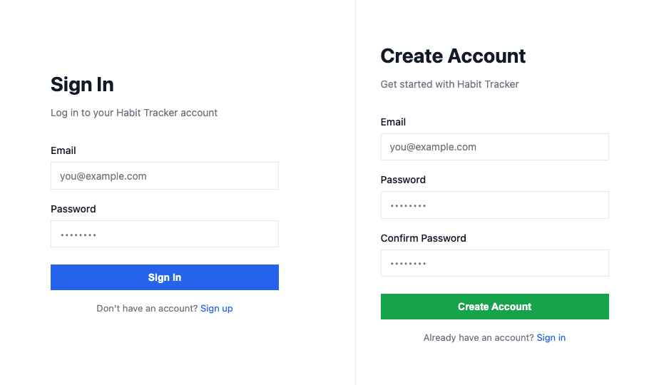
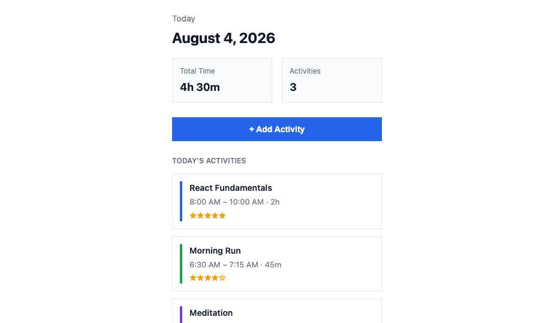
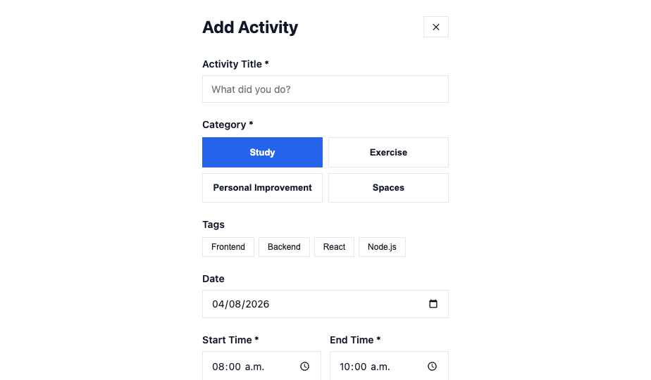
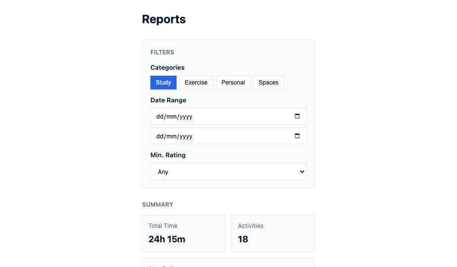
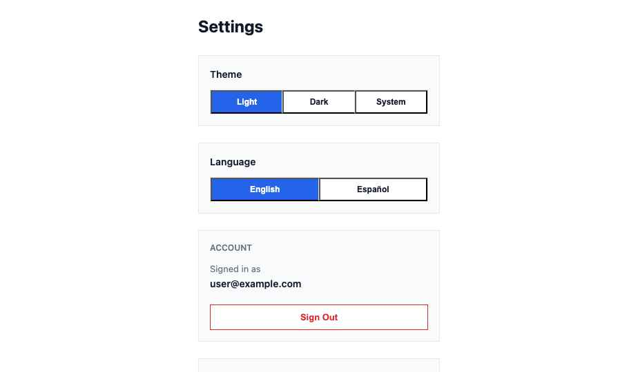
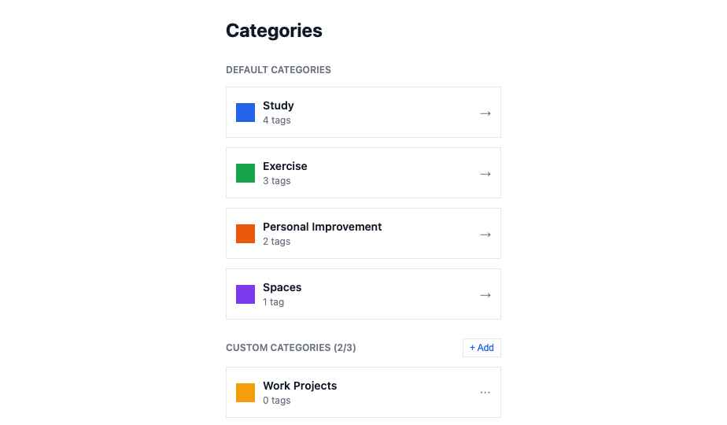
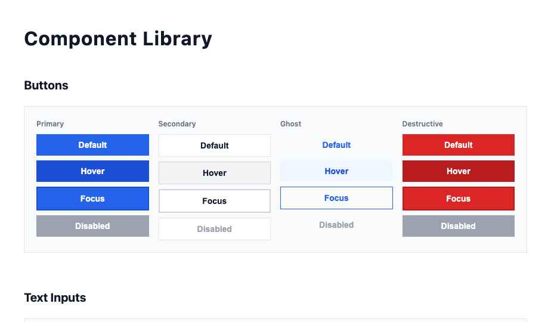
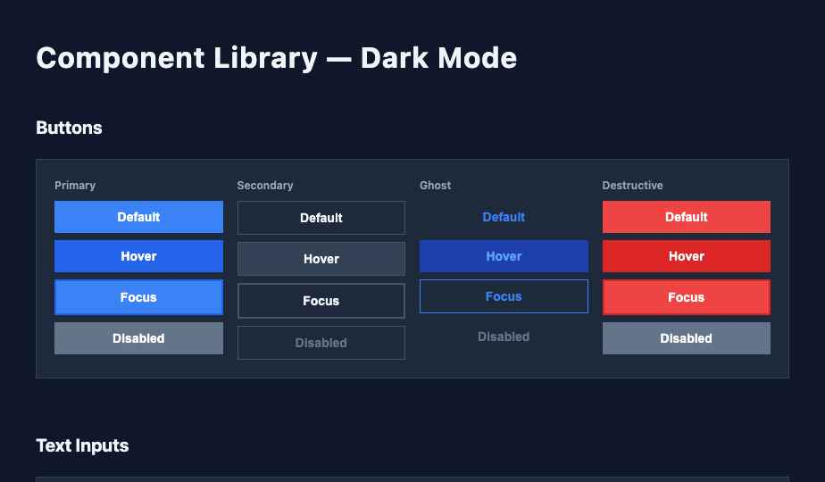

# Habit Tracker — Complete Tailwind & HTML Export

**Last generated:** August 4, 2026

---

## Table of Contents

1. [tailwind.config.ts](#tailwindconfigts)
2. [Component Classes Reference](#component-classes-reference)
3. [Screen Markup](#screen-markup)

---

## tailwind.config.ts

```typescript
import type { Config } from 'tailwindcss';

const config: Config = {
  darkMode: 'class',
  theme: {
    extend: {
      colors: {
        // Category colors
        'category-study': '#2563eb',
        'category-exercise': '#16a34a',
        'category-personal': '#ea580c',
        'category-spaces': '#7c3aed',
        'category-rating': '#f59e0b',
        
        // Dark mode category colors
        'category-study-dark': '#3b82f6',
        'category-exercise-dark': '#22c55e',
        'category-personal-dark': '#f97316',
        'category-spaces-dark': '#a78bfa',

        // Surface colors (light mode)
        'surface-primary': '#ffffff',
        'surface-secondary': '#f9fafb',
        'surface-tertiary': '#f3f4f6',

        // Surface colors (dark mode)
        'surface-primary-dark': '#0f172a',
        'surface-secondary-dark': '#1e293b',
        'surface-tertiary-dark': '#334155',

        // Content colors (light mode)
        'content-primary': '#111827',
        'content-secondary': '#374151',
        'content-tertiary': '#6b7280',

        // Content colors (dark mode)
        'content-primary-dark': '#f1f5f9',
        'content-secondary-dark': '#cbd5e1',
        'content-tertiary-dark': '#94a3b8',

        // Border colors (light mode)
        'border-light': '#e5e7eb',
        'border-medium': '#d1d5db',

        // Border colors (dark mode)
        'border-light-dark': '#334155',
        'border-medium-dark': '#475569',
      },
      borderRadius: {
        'none': '0',
      },
      spacing: {
        '0.5': '2px',
        '1': '4px',
        '1.5': '6px',
        '2': '8px',
        '2.5': '10px',
        '3': '12px',
        '4': '16px',
        '5': '20px',
        '6': '24px',
        '8': '32px',
        '10': '40px',
        '12': '48px',
        '16': '64px',
        '20': '80px',
        '24': '96px',
        '32': '128px',
      },
      fontSize: {
        'xs': ['12px', { lineHeight: '1.5' }],
        'sm': ['13px', { lineHeight: '1.5' }],
        'base': ['14px', { lineHeight: '1.5' }],
        'lg': ['15px', { lineHeight: '1.5' }],
        'xl': ['16px', { lineHeight: '1.5' }],
        '2xl': ['18px', { lineHeight: '1.5' }],
        '3xl': ['20px', { lineHeight: '1.5' }],
        '4xl': ['24px', { lineHeight: '1.5' }],
        '5xl': ['28px', { lineHeight: '1.5' }],
        '6xl': ['32px', { lineHeight: '1.5' }],
      },
      fontWeight: {
        '400': '400',
        '600': '600',
        '700': '700',
      },
    },
  },
  plugins: [],
};

export default config;

```

---

## Component Classes Reference

# Habit Tracker — Tailwind Component Class Reference

All components use sharp corners (`rounded-none`) and no transitions. Dark mode uses `dark:` prefix on the same element.

---

## Buttons

### Primary Button
```
Default:     px-4 py-2.5 bg-category-study text-white font-600 text-base rounded-none
Hover:       px-4 py-2.5 bg-blue-700 text-white font-600 text-base rounded-none
Focus:       px-4 py-2.5 bg-category-study text-white font-600 text-base rounded-none border-2 border-blue-700
Active:      px-4 py-2.5 bg-blue-700 text-white font-600 text-base rounded-none
Disabled:    px-4 py-2.5 bg-gray-400 text-white font-600 text-base rounded-none cursor-not-allowed

Dark mode additions:
dark:bg-category-study-dark dark:hover:bg-blue-500 dark:border-blue-500
```

### Secondary Button
```
Default:     px-4 py-2.5 bg-white border border-border-light text-content-primary font-600 text-base rounded-none
Hover:       px-4 py-2.5 bg-surface-tertiary border border-border-medium text-content-primary font-600 text-base rounded-none
Focus:       px-4 py-2.5 bg-white border-2 border-border-medium text-content-primary font-600 text-base rounded-none
Disabled:    px-4 py-2.5 bg-white border border-border-light text-content-tertiary font-600 text-base rounded-none cursor-not-allowed

Dark mode additions:
dark:bg-surface-secondary-dark dark:border-border-light-dark dark:text-content-primary-dark
dark:hover:bg-surface-tertiary-dark dark:hover:border-border-medium-dark
```

### Ghost Button
```
Default:     px-4 py-2.5 bg-transparent text-category-study font-600 text-base rounded-none
Hover:       px-4 py-2.5 bg-blue-50 text-blue-700 font-600 text-base rounded-none
Focus:       px-4 py-2.5 bg-transparent border border-category-study text-category-study font-600 text-base rounded-none
Disabled:    px-4 py-2.5 bg-transparent text-gray-400 font-600 text-base rounded-none cursor-not-allowed

Dark mode additions:
dark:text-category-study-dark dark:hover:bg-blue-900/20
```

### Destructive Button
```
Default:     px-4 py-2.5 bg-red-600 text-white font-600 text-base rounded-none
Hover:       px-4 py-2.5 bg-red-700 text-white font-600 text-base rounded-none
Focus:       px-4 py-2.5 bg-red-600 text-white font-600 text-base rounded-none border-2 border-red-700
Disabled:    px-4 py-2.5 bg-gray-400 text-white font-600 text-base rounded-none cursor-not-allowed
```

---

## Text Input
```
Default:     w-full px-3 py-2.5 border border-border-light bg-surface-primary text-content-primary text-base rounded-none placeholder-content-tertiary
Focused:     w-full px-3 py-2.5 border-2 border-category-study bg-surface-primary text-content-primary text-base rounded-none
Filled:      w-full px-3 py-2.5 border border-border-medium bg-surface-secondary text-content-primary text-base rounded-none
Error:       w-full px-3 py-2.5 border-2 border-red-600 bg-surface-primary text-content-primary text-base rounded-none
Disabled:    w-full px-3 py-2.5 border border-border-light bg-surface-tertiary text-content-tertiary text-base rounded-none cursor-not-allowed

Dark mode additions:
dark:bg-surface-primary-dark dark:border-border-light-dark dark:text-content-primary-dark dark:placeholder-content-tertiary-dark
dark:focus:border-category-study-dark
```

---

## Select / Dropdown
```
Default:     w-full px-3 py-2.5 border border-border-light bg-surface-primary text-content-primary text-base rounded-none appearance-none
Focused:     w-full px-3 py-2.5 border-2 border-category-study bg-surface-primary text-content-primary text-base rounded-none appearance-none
Disabled:    w-full px-3 py-2.5 border border-border-light bg-surface-tertiary text-content-tertiary text-base rounded-none appearance-none cursor-not-allowed

Dark mode additions:
dark:bg-surface-primary-dark dark:border-border-light-dark dark:text-content-primary-dark
dark:focus:border-category-study-dark
```

---

## Category Chips
```
Unselected:  px-3.5 py-2.5 border border-border-light bg-white text-content-primary font-600 text-sm rounded-none
Selected:    px-3.5 py-2.5 border-2 border-{category} bg-{category} text-white font-600 text-sm rounded-none

Categories: 
  - Study:              border-category-study bg-category-study
  - Exercise:           border-category-exercise bg-category-exercise
  - Personal:           border-category-personal bg-category-personal
  - Spaces:             border-category-spaces bg-category-spaces

Dark mode additions (selected):
dark:bg-{category}-dark dark:border-{category}-dark
```

---

## Tag Badges
```
Default:     px-2.5 py-1.5 border border-border-light bg-white text-content-primary text-xs rounded-none
Selected:    px-2.5 py-1.5 border-2 border-category-study bg-category-study text-white text-xs rounded-none font-600
Disabled:    px-2.5 py-1.5 border border-border-light bg-surface-secondary text-content-tertiary text-xs rounded-none cursor-not-allowed

Dark mode additions:
dark:border-border-light-dark dark:bg-surface-secondary-dark dark:text-content-primary-dark
dark:selected:bg-category-study-dark dark:selected:border-category-study-dark
```

---

## Star Rating Control (Interactive)
```
Filled Star:   px-3 py-2 border border-border-light bg-white text-category-rating text-xl rounded-none cursor-pointer
Empty Star:    px-3 py-2 border border-border-light bg-white text-border-medium text-xl rounded-none cursor-pointer
Unrated Btn:   px-3 py-2 border border-border-light bg-white text-content-tertiary text-xs rounded-none cursor-pointer

Dark mode additions:
dark:border-border-light-dark dark:bg-surface-secondary-dark
```

---

## Activity Card
```
Container:   p-3 border border-border-light bg-surface-primary rounded-none flex gap-3
Color Bar:   w-1 flex-shrink-0 bg-{category}
Title:       text-sm font-600 text-content-primary
Time/Duration: text-xs text-content-secondary
Notes:       text-xs text-content-tertiary
Rating:      text-xs text-category-rating

Dark mode additions:
dark:border-border-light-dark dark:bg-surface-secondary-dark
dark:text-content-primary-dark (titles)
dark:text-content-secondary-dark (meta)
```

---

## Time Picker & Date Input
```
Default:     w-full px-3 py-2.5 border border-border-light bg-surface-primary text-content-primary text-base rounded-none
Focused:     w-full px-3 py-2.5 border-2 border-category-study bg-surface-primary text-content-primary text-base rounded-none

Dark mode additions:
dark:bg-surface-primary-dark dark:border-border-light-dark dark:text-content-primary-dark
dark:focus:border-category-study-dark
```

---

## Toggle / Segmented Controls
```
Container:       flex border border-border-light w-fit rounded-none
Button Default:  px-4 py-2 border-r border-border-light bg-surface-primary text-content-primary font-600 text-sm rounded-none
Button Selected: px-4 py-2 border-r border-border-light bg-category-study text-white font-600 text-sm rounded-none
Button Last:     px-4 py-2 bg-surface-primary text-content-primary font-600 text-sm rounded-none (no right border)

Dark mode additions:
dark:border-border-light-dark dark:bg-surface-secondary-dark dark:text-content-primary-dark
dark:selected:bg-category-study-dark
```

---

## Toast Notifications

### Success Toast
```
Container:   p-3 border border-category-exercise bg-surface-primary rounded-none flex justify-between items-center
Message:     text-xs font-600 text-category-exercise
Close Btn:   bg-transparent text-content-tertiary text-base rounded-none cursor-pointer

Dark mode additions:
dark:bg-surface-secondary-dark dark:border-category-exercise-dark
dark:text-category-exercise-dark
```

### Error Toast
```
Container:   p-3 border border-red-600 bg-surface-primary rounded-none flex justify-between items-center
Message:     text-xs font-600 text-red-600
Close Btn:   bg-transparent text-content-tertiary text-base rounded-none cursor-pointer

Dark mode additions:
dark:bg-surface-secondary-dark
```

---

## Summary Stats / Info Box
```
Container:   p-3 bg-surface-secondary border border-border-light rounded-none
Label:       text-xs text-content-tertiary font-600 text-transform: uppercase
Value:       text-lg font-700 text-content-primary

Dark mode additions:
dark:bg-surface-tertiary-dark dark:border-border-light-dark
dark:text-content-primary-dark (value)
dark:text-content-tertiary-dark (label)
```

---

## Empty State
```
Container:   p-10 bg-surface-secondary border border-border-light text-center rounded-none
Title:       text-base text-content-secondary
Message:     text-sm text-content-tertiary
CTA Button:  px-5 py-2.5 bg-category-study text-white font-600 text-base rounded-none

Dark mode additions:
dark:bg-surface-tertiary-dark dark:border-border-light-dark
dark:text-content-secondary-dark (title)
dark:text-content-tertiary-dark (message)
```

---

## Responsive Breakpoints

Mobile-first: Default styles target 390px width.
Desktop (1024px+): Use `lg:` prefix for layout and sizing changes.

Common patterns:
- Mobile: Single column, stacked form fields
- Desktop: Multi-column grids, side-by-side layouts
- Text sizes remain constant (no scale changes)

---

## General Rules

1. **No transitions or animations** — all state changes are instant
2. **No drop shadows** — use borders for separation
3. **Borders always 1px** — light borders for default, 2px for focus states
4. **Colors from token names** — never hardcoded hex in markup
5. **Dark mode:** Apply `dark:` variants on the same element; no separate component markup
6. **Spacing:** Use the 4px base scale; 6px and 10px are genuine members
7. **All corners rounded-none** — explicit on every container to prevent accidents


---

## Screen Markup

### Auth Screen

```html
<x-dc>
<helmet>
  <meta charset="utf-8">
  <meta name="viewport" content="width=device-width, initial-scale=1">
  <style>
    * { margin: 0; padding: 0; box-sizing: border-box; }
    body { font-family: -apple-system, BlinkMacSystemFont, 'Segoe UI', sans-serif; background: #ffffff; color: #111827; line-height: 1.5; }
    input { font-family: inherit; }
  </style>
</helmet>

<div style="display: flex; min-height: 100vh;">
  <!-- Sign In -->
  <div style="flex: 1; padding: 40px 20px; display: flex; flex-direction: column; justify-content: center; align-items: center; max-width: 390px; margin: 0 auto;">
    <div style="width: 100%; max-width: 320px;">
      <h1 style="font-size: 28px; font-weight: 700; margin-bottom: 8px;">Sign In</h1>
      <p style="color: #6b7280; margin-bottom: 32px; font-size: 14px;">Log in to your Habit Tracker account</p>
      
      <div style="margin-bottom: 16px;">
        <label style="display: block; font-size: 14px; font-weight: 500; margin-bottom: 6px; color: #111827;">Email</label>
        <input type="email" placeholder="you@example.com" style="width: 100%; padding: 10px 12px; border: 1px solid #e5e7eb; background: #ffffff; font-size: 14px; color: #111827;">
      </div>
      
      <div style="margin-bottom: 24px;">
        <label style="display: block; font-size: 14px; font-weight: 500; margin-bottom: 6px; color: #111827;">Password</label>
        <input type="password" placeholder="••••••••" style="width: 100%; padding: 10px 12px; border: 1px solid #e5e7eb; background: #ffffff; font-size: 14px; color: #111827;">
      </div>
      
      <button style="width: 100%; padding: 10px; background: #2563eb; color: white; border: none; font-size: 14px; font-weight: 600; cursor: pointer; margin-bottom: 16px;">Sign In</button>
      
      <p style="text-align: center; font-size: 13px; color: #6b7280;">Don't have an account? <a href="#" style="color: #2563eb; text-decoration: none;">Sign up</a></p>
    </div>
  </div>

  <!-- Sign Up -->
  <div style="flex: 1; padding: 40px 20px; display: flex; flex-direction: column; justify-content: center; align-items: center; max-width: 390px; margin: 0 auto; border-left: 1px solid #e5e7eb;">
    <div style="width: 100%; max-width: 320px;">
      <h1 style="font-size: 28px; font-weight: 700; margin-bottom: 8px;">Create Account</h1>
      <p style="color: #6b7280; margin-bottom: 32px; font-size: 14px;">Get started with Habit Tracker</p>
      
      <div style="margin-bottom: 16px;">
        <label style="display: block; font-size: 14px; font-weight: 500; margin-bottom: 6px; color: #111827;">Email</label>
        <input type="email" placeholder="you@example.com" style="width: 100%; padding: 10px 12px; border: 1px solid #e5e7eb; background: #ffffff; font-size: 14px; color: #111827;">
      </div>
      
      <div style="margin-bottom: 16px;">
        <label style="display: block; font-size: 14px; font-weight: 500; margin-bottom: 6px; color: #111827;">Password</label>
        <input type="password" placeholder="••••••••" style="width: 100%; padding: 10px 12px; border: 1px solid #e5e7eb; background: #ffffff; font-size: 14px; color: #111827;">
      </div>
      
      <div style="margin-bottom: 24px;">
        <label style="display: block; font-size: 14px; font-weight: 500; margin-bottom: 6px; color: #111827;">Confirm Password</label>
        <input type="password" placeholder="••••••••" style="width: 100%; padding: 10px 12px; border: 1px solid #e5e7eb; background: #ffffff; font-size: 14px; color: #111827;">
      </div>
      
      <button style="width: 100%; padding: 10px; background: #16a34a; color: white; border: none; font-size: 14px; font-weight: 600; cursor: pointer; margin-bottom: 16px;">Create Account</button>
      
      <p style="text-align: center; font-size: 13px; color: #6b7280;">Already have an account? <a href="#" style="color: #2563eb; text-decoration: none;">Sign in</a></p>
    </div>
  </div>
</div>
</x-dc>
```

### Dashboard Screen

```html
<x-dc>
<helmet>
  <meta charset="utf-8">
  <meta name="viewport" content="width=device-width, initial-scale=1">
  <style>
    * { margin: 0; padding: 0; box-sizing: border-box; }
    body { font-family: -apple-system, BlinkMacSystemFont, 'Segoe UI', sans-serif; background: #ffffff; color: #111827; line-height: 1.5; }
  </style>
</helmet>

<!-- MOBILE VIEW (390px) -->
<div style="max-width: 390px; margin: 0 auto; background: #ffffff; min-height: 100vh; padding: 20px;">
  <!-- Header with date and summary -->
  <div style="margin-bottom: 24px;">
    <p style="font-size: 14px; color: #6b7280; margin-bottom: 4px;">Today</p>
    <h1 style="font-size: 24px; font-weight: 700; margin-bottom: 16px;">August 4, 2026</h1>
    
    <div style="display: flex; gap: 16px; margin-bottom: 16px;">
      <div style="flex: 1; padding: 12px; background: #f9fafb; border: 1px solid #e5e7eb;">
        <p style="font-size: 12px; color: #6b7280; margin-bottom: 4px;">Total Time</p>
        <p style="font-size: 18px; font-weight: 700;">4h 30m</p>
      </div>
      <div style="flex: 1; padding: 12px; background: #f9fafb; border: 1px solid #e5e7eb;">
        <p style="font-size: 12px; color: #6b7280; margin-bottom: 4px;">Activities</p>
        <p style="font-size: 18px; font-weight: 700;">3</p>
      </div>
    </div>
  </div>

  <!-- Primary action -->
  <button style="width: 100%; padding: 12px; background: #2563eb; color: white; border: none; font-size: 14px; font-weight: 600; cursor: pointer; margin-bottom: 24px;">+ Add Activity</button>

  <!-- Activities list -->
  <div style="margin-bottom: 24px;">
    <p style="font-size: 12px; color: #6b7280; font-weight: 600; margin-bottom: 12px; text-transform: uppercase;">Today's Activities</p>
    
    <!-- Activity card 1 -->
    <div style="padding: 12px; border: 1px solid #e5e7eb; margin-bottom: 12px; display: flex; gap: 12px;">
      <div style="width: 4px; background: #2563eb;"></div>
      <div style="flex: 1;">
        <p style="font-size: 14px; font-weight: 600; color: #111827; margin-bottom: 4px;">React Fundamentals</p>
        <p style="font-size: 13px; color: #6b7280; margin-bottom: 4px;">8:00 AM – 10:00 AM · 2h</p>
        <div style="display: flex; gap: 8px; align-items: center;">
          <span style="font-size: 12px; color: #f59e0b;">★★★★★</span>
        </div>
      </div>
    </div>

    <!-- Activity card 2 -->
    <div style="padding: 12px; border: 1px solid #e5e7eb; margin-bottom: 12px; display: flex; gap: 12px;">
      <div style="width: 4px; background: #16a34a;"></div>
      <div style="flex: 1;">
        <p style="font-size: 14px; font-weight: 600; color: #111827; margin-bottom: 4px;">Morning Run</p>
        <p style="font-size: 13px; color: #6b7280; margin-bottom: 4px;">6:30 AM – 7:15 AM · 45m</p>
        <div style="display: flex; gap: 8px; align-items: center;">
          <span style="font-size: 12px; color: #f59e0b;">★★★★☆</span>
        </div>
      </div>
    </div>

    <!-- Activity card 3 -->
    <div style="padding: 12px; border: 1px solid #e5e7eb; margin-bottom: 12px; display: flex; gap: 12px;">
      <div style="width: 4px; background: #7c3aed;"></div>
      <div style="flex: 1;">
        <p style="font-size: 14px; font-weight: 600; color: #111827; margin-bottom: 4px;">Meditation</p>
        <p style="font-size: 13px; color: #6b7280; margin-bottom: 4px;">7:00 PM – 7:15 PM · 15m</p>
        <div style="display: flex; gap: 8px; align-items: center;">
          <span style="font-size: 12px; color: #f59e0b;">★★★☆☆</span>
        </div>
      </div>
    </div>
  </div>

  <!-- Day selector -->
  <div style="display: flex; gap: 8px; margin-bottom: 24px; overflow-x: auto;">
    <button style="padding: 8px 12px; border: 1px solid #2563eb; background: #2563eb; color: white; font-size: 12px; font-weight: 600; cursor: pointer; flex-shrink: 0;">Today</button>
    <button style="padding: 8px 12px; border: 1px solid #e5e7eb; background: white; color: #111827; font-size: 12px; font-weight: 600; cursor: pointer; flex-shrink: 0;">Yesterday</button>
    <button style="padding: 8px 12px; border: 1px solid #e5e7eb; background: white; color: #111827; font-size: 12px; font-weight: 600; cursor: pointer; flex-shrink: 0;">Aug 2</button>
    <button style="padding: 8px 12px; border: 1px solid #e5e7eb; background: white; color: #111827; font-size: 12px; font-weight: 600; cursor: pointer; flex-shrink: 0;">Aug 1</button>
  </div>
</div>

<!-- DESKTOP VIEW (1440px) -->
<div style="display: none; max-width: 1440px; margin: 0 auto; background: #ffffff; min-height: 100vh; padding: 40px; gap: 40px;">
  <style>
    @media (min-width: 1024px) {
      div[style*="display: none"] { display: grid !important; grid-template-columns: 1fr 2fr; }
    }
  </style>

  <!-- Left sidebar: filters and summary -->
  <div style="background: #f9fafb; padding: 24px; border: 1px solid #e5e7eb;">
    <h2 style="font-size: 16px; font-weight: 700; margin-bottom: 20px;">August 4, 2026</h2>
    
    <div style="margin-bottom: 24px;">
      <p style="font-size: 12px; color: #6b7280; font-weight: 600; text-transform: uppercase; margin-bottom: 8px;">Summary</p>
      <div style="margin-bottom: 12px;">
        <p style="font-size: 12px; color: #6b7280;">Total Time</p>
        <p style="font-size: 20px; font-weight: 700;">4h 30m</p>
      </div>
      <div>
        <p style="font-size: 12px; color: #6b7280;">Activities</p>
        <p style="font-size: 20px; font-weight: 700;">3</p>
      </div>
    </div>

    <button style="width: 100%; padding: 10px; background: #2563eb; color: white; border: none; font-size: 14px; font-weight: 600; cursor: pointer;">+ Add Activity</button>

    <div style="margin-top: 24px; padding-top: 24px; border-top: 1px solid #d1d5db;">
      <p style="font-size: 12px; color: #6b7280; font-weight: 600; text-transform: uppercase; margin-bottom: 12px;">Navigate</p>
      <div style="display: flex; flex-direction: column; gap: 8px;">
        <button style="padding: 8px 12px; border: 1px solid #2563eb; background: #2563eb; color: white; font-size: 13px; font-weight: 600; cursor: pointer; text-align: left;">Today</button>
        <button style="padding: 8px 12px; border: 1px solid #e5e7eb; background: white; color: #111827; font-size: 13px; font-weight: 600; cursor: pointer; text-align: left;">Yesterday</button>
        <button style="padding: 8px 12px; border: 1px solid #e5e7eb; background: white; color: #111827; font-size: 13px; font-weight: 600; cursor: pointer; text-align: left;">Aug 2</button>
        <button style="padding: 8px 12px; border: 1px solid #e5e7eb; background: white; color: #111827; font-size: 13px; font-weight: 600; cursor: pointer; text-align: left;">Aug 1</button>
      </div>
    </div>
  </div>

  <!-- Right main content: activities list -->
  <div>
    <h2 style="font-size: 20px; font-weight: 700; margin-bottom: 24px;">Today's Activities</h2>
    
    <div style="display: flex; flex-direction: column; gap: 12px;">
      <!-- Activity card 1 -->
      <div style="padding: 16px; border: 1px solid #e5e7eb; display: flex; gap: 16px;">
        <div style="width: 6px; background: #2563eb; flex-shrink: 0;"></div>
        <div style="flex: 1;">
          <p style="font-size: 15px; font-weight: 600; color: #111827; margin-bottom: 6px;">React Fundamentals</p>
          <p style="font-size: 14px; color: #6b7280; margin-bottom: 6px;">8:00 AM – 10:00 AM · 2h</p>
          <div style="display: flex; gap: 8px; align-items: center;">
            <span style="font-size: 13px; color: #f59e0b;">★★★★★</span>
          </div>
        </div>
      </div>

      <!-- Activity card 2 -->
      <div style="padding: 16px; border: 1px solid #e5e7eb; display: flex; gap: 16px;">
        <div style="width: 6px; background: #16a34a; flex-shrink: 0;"></div>
        <div style="flex: 1;">
          <p style="font-size: 15px; font-weight: 600; color: #111827; margin-bottom: 6px;">Morning Run</p>
          <p style="font-size: 14px; color: #6b7280; margin-bottom: 6px;">6:30 AM – 7:15 AM · 45m</p>
          <div style="display: flex; gap: 8px; align-items: center;">
            <span style="font-size: 13px; color: #f59e0b;">★★★★☆</span>
          </div>
        </div>
      </div>

      <!-- Activity card 3 -->
      <div style="padding: 16px; border: 1px solid #e5e7eb; display: flex; gap: 16px;">
        <div style="width: 6px; background: #7c3aed; flex-shrink: 0;"></div>
        <div style="flex: 1;">
          <p style="font-size: 15px; font-weight: 600; color: #111827; margin-bottom: 6px;">Meditation</p>
          <p style="font-size: 14px; color: #6b7280; margin-bottom: 6px;">7:00 PM – 7:15 PM · 15m</p>
          <div style="display: flex; gap: 8px; align-items: center;">
            <span style="font-size: 13px; color: #f59e0b;">★★★☆☆</span>
          </div>
        </div>
      </div>
    </div>
  </div>
</div>
</x-dc>
```

### Add Activity Screen

```html
<x-dc>
<helmet>
  <meta charset="utf-8">
  <meta name="viewport" content="width=device-width, initial-scale=1">
  <style>
    * { margin: 0; padding: 0; box-sizing: border-box; }
    body { font-family: -apple-system, BlinkMacSystemFont, 'Segoe UI', sans-serif; background: #ffffff; color: #111827; line-height: 1.5; }
    input, select, textarea { font-family: inherit; }
  </style>
</helmet>

<!-- MOBILE VIEW (390px) -->
<div style="max-width: 390px; margin: 0 auto; background: #ffffff; min-height: 100vh; padding: 20px;">
  <div style="display: flex; justify-content: space-between; align-items: center; margin-bottom: 24px;">
    <h1 style="font-size: 24px; font-weight: 700;">Add Activity</h1>
    <button style="border: 1px solid #e5e7eb; background: white; color: #111827; padding: 6px 12px; font-size: 13px; cursor: pointer;">✕</button>
  </div>

  <!-- Title input -->
  <div style="margin-bottom: 20px;">
    <label style="display: block; font-size: 14px; font-weight: 600; margin-bottom: 6px; color: #111827;">Activity Title *</label>
    <input type="text" placeholder="What did you do?" style="width: 100%; padding: 10px 12px; border: 1px solid #e5e7eb; background: #ffffff; font-size: 14px; color: #111827;">
  </div>

  <!-- Category selector -->
  <div style="margin-bottom: 20px;">
    <label style="display: block; font-size: 14px; font-weight: 600; margin-bottom: 8px; color: #111827;">Category *</label>
    <div style="display: grid; grid-template-columns: 1fr 1fr; gap: 8px;">
      <button style="padding: 12px; border: 2px solid #2563eb; background: #2563eb; color: white; font-size: 13px; font-weight: 600; cursor: pointer; text-align: center;">Study</button>
      <button style="padding: 12px; border: 1px solid #e5e7eb; background: white; color: #111827; font-size: 13px; font-weight: 600; cursor: pointer; text-align: center;">Exercise</button>
      <button style="padding: 12px; border: 1px solid #e5e7eb; background: white; color: #111827; font-size: 13px; font-weight: 600; cursor: pointer; text-align: center;">Personal Improvement</button>
      <button style="padding: 12px; border: 1px solid #e5e7eb; background: white; color: #111827; font-size: 13px; font-weight: 600; cursor: pointer; text-align: center;">Spaces</button>
    </div>
  </div>

  <!-- Tags selector (Study tags shown) -->
  <div style="margin-bottom: 20px;">
    <label style="display: block; font-size: 14px; font-weight: 600; margin-bottom: 8px; color: #111827;">Tags</label>
    <div style="display: flex; flex-wrap: wrap; gap: 6px;">
      <button style="padding: 6px 12px; border: 1px solid #e5e7eb; background: white; color: #111827; font-size: 12px; cursor: pointer;">Frontend</button>
      <button style="padding: 6px 12px; border: 1px solid #e5e7eb; background: white; color: #111827; font-size: 12px; cursor: pointer;">Backend</button>
      <button style="padding: 6px 12px; border: 1px solid #e5e7eb; background: white; color: #111827; font-size: 12px; cursor: pointer;">React</button>
      <button style="padding: 6px 12px; border: 1px solid #e5e7eb; background: white; color: #111827; font-size: 12px; cursor: pointer;">Node.js</button>
    </div>
  </div>

  <!-- Date -->
  <div style="margin-bottom: 20px;">
    <label style="display: block; font-size: 14px; font-weight: 600; margin-bottom: 6px; color: #111827;">Date</label>
    <input type="date" value="2026-08-04" style="width: 100%; padding: 10px 12px; border: 1px solid #e5e7eb; background: #ffffff; font-size: 14px; color: #111827;">
  </div>

  <!-- Start & End time -->
  <div style="display: grid; grid-template-columns: 1fr 1fr; gap: 12px; margin-bottom: 20px;">
    <div>
      <label style="display: block; font-size: 14px; font-weight: 600; margin-bottom: 6px; color: #111827;">Start Time *</label>
      <input type="time" value="08:00" style="width: 100%; padding: 10px 12px; border: 1px solid #e5e7eb; background: #ffffff; font-size: 14px; color: #111827;">
    </div>
    <div>
      <label style="display: block; font-size: 14px; font-weight: 600; margin-bottom: 6px; color: #111827;">End Time *</label>
      <input type="time" value="10:00" style="width: 100%; padding: 10px 12px; border: 1px solid #e5e7eb; background: #ffffff; font-size: 14px; color: #111827;">
    </div>
  </div>

  <!-- Duration display -->
  <div style="padding: 10px 12px; background: #f9fafb; border: 1px solid #e5e7eb; margin-bottom: 20px;">
    <p style="font-size: 13px; color: #6b7280;">Duration: <strong>2h 0m</strong></p>
  </div>

  <!-- Star rating -->
  <div style="margin-bottom: 20px;">
    <label style="display: block; font-size: 14px; font-weight: 600; margin-bottom: 8px; color: #111827;">Rating</label>
    <div style="display: flex; gap: 6px;">
      <button style="padding: 8px 12px; border: 1px solid #e5e7eb; background: white; color: #f59e0b; font-size: 18px; cursor: pointer;">★</button>
      <button style="padding: 8px 12px; border: 1px solid #e5e7eb; background: white; color: #f59e0b; font-size: 18px; cursor: pointer;">★</button>
      <button style="padding: 8px 12px; border: 1px solid #e5e7eb; background: white; color: #f59e0b; font-size: 18px; cursor: pointer;">★</button>
      <button style="padding: 8px 12px; border: 1px solid #e5e7eb; background: white; color: #f59e0b; font-size: 18px; cursor: pointer;">★</button>
      <button style="padding: 8px 12px; border: 1px solid #e5e7eb; background: white; color: #d1d5db; font-size: 18px; cursor: pointer;">★</button>
      <button style="padding: 8px 12px; border: 1px solid #e5e7eb; background: white; color: #6b7280; font-size: 13px; cursor: pointer;">Unrated</button>
    </div>
  </div>

  <!-- Notes -->
  <div style="margin-bottom: 24px;">
    <label style="display: block; font-size: 14px; font-weight: 600; margin-bottom: 6px; color: #111827;">Notes</label>
    <textarea placeholder="Optional notes..." style="width: 100%; padding: 10px 12px; border: 1px solid #e5e7eb; background: #ffffff; font-size: 14px; color: #111827; min-height: 80px; resize: vertical;"></textarea>
  </div>

  <!-- Actions -->
  <div style="display: grid; grid-template-columns: 1fr 1fr; gap: 12px;">
    <button style="padding: 12px; border: 1px solid #e5e7eb; background: white; color: #111827; font-size: 14px; font-weight: 600; cursor: pointer;">Cancel</button>
    <button style="padding: 12px; border: 1px solid #2563eb; background: #2563eb; color: white; font-size: 14px; font-weight: 600; cursor: pointer;">Save</button>
  </div>
</div>

<!-- DESKTOP VIEW (1440px) -->
<div style="display: none; max-width: 800px; margin: 0 auto; background: #ffffff; min-height: 100vh; padding: 40px;">
  <style>
    @media (min-width: 1024px) {
      div[style*="display: none"] { display: block !important; }
    }
  </style>

  <div style="display: flex; justify-content: space-between; align-items: center; margin-bottom: 32px;">
    <h1 style="font-size: 32px; font-weight: 700;">Add Activity</h1>
    <button style="border: 1px solid #e5e7eb; background: white; color: #111827; padding: 8px 16px; font-size: 14px; cursor: pointer;">✕</button>
  </div>

  <!-- Title input -->
  <div style="margin-bottom: 24px;">
    <label style="display: block; font-size: 14px; font-weight: 600; margin-bottom: 8px; color: #111827;">Activity Title *</label>
    <input type="text" placeholder="What did you do?" style="width: 100%; padding: 12px 14px; border: 1px solid #e5e7eb; background: #ffffff; font-size: 14px; color: #111827;">
  </div>

  <!-- Category selector -->
  <div style="margin-bottom: 24px;">
    <label style="display: block; font-size: 14px; font-weight: 600; margin-bottom: 8px; color: #111827;">Category *</label>
    <div style="display: grid; grid-template-columns: 1fr 1fr 1fr 1fr; gap: 12px;">
      <button style="padding: 14px; border: 2px solid #2563eb; background: #2563eb; color: white; font-size: 14px; font-weight: 600; cursor: pointer; text-align: center;">Study</button>
      <button style="padding: 14px; border: 1px solid #e5e7eb; background: white; color: #111827; font-size: 14px; font-weight: 600; cursor: pointer; text-align: center;">Exercise</button>
      <button style="padding: 14px; border: 1px solid #e5e7eb; background: white; color: #111827; font-size: 14px; font-weight: 600; cursor: pointer; text-align: center;">Personal Improvement</button>
      <button style="padding: 14px; border: 1px solid #e5e7eb; background: white; color: #111827; font-size: 14px; font-weight: 600; cursor: pointer; text-align: center;">Spaces</button>
    </div>
  </div>

  <!-- Tags and Date in grid -->
  <div style="display: grid; grid-template-columns: 2fr 1fr; gap: 24px; margin-bottom: 24px;">
    <div>
      <label style="display: block; font-size: 14px; font-weight: 600; margin-bottom: 8px; color: #111827;">Tags</label>
      <div style="display: flex; flex-wrap: wrap; gap: 8px;">
        <button style="padding: 8px 14px; border: 1px solid #e5e7eb; background: white; color: #111827; font-size: 13px; cursor: pointer;">Frontend</button>
        <button style="padding: 8px 14px; border: 1px solid #e5e7eb; background: white; color: #111827; font-size: 13px; cursor: pointer;">Backend</button>
        <button style="padding: 8px 14px; border: 1px solid #e5e7eb; background: white; color: #111827; font-size: 13px; cursor: pointer;">React</button>
        <button style="padding: 8px 14px; border: 1px solid #e5e7eb; background: white; color: #111827; font-size: 13px; cursor: pointer;">Node.js</button>
      </div>
    </div>
    <div>
      <label style="display: block; font-size: 14px; font-weight: 600; margin-bottom: 8px; color: #111827;">Date</label>
      <input type="date" value="2026-08-04" style="width: 100%; padding: 12px 14px; border: 1px solid #e5e7eb; background: #ffffff; font-size: 14px; color: #111827;">
    </div>
  </div>

  <!-- Times and Duration -->
  <div style="display: grid; grid-template-columns: 1fr 1fr 1fr; gap: 12px; margin-bottom: 24px;">
    <div>
      <label style="display: block; font-size: 14px; font-weight: 600; margin-bottom: 8px; color: #111827;">Start Time *</label>
      <input type="time" value="08:00" style="width: 100%; padding: 12px 14px; border: 1px solid #e5e7eb; background: #ffffff; font-size: 14px; color: #111827;">
    </div>
    <div>
      <label style="display: block; font-size: 14px; font-weight: 600; margin-bottom: 8px; color: #111827;">End Time *</label>
      <input type="time" value="10:00" style="width: 100%; padding: 12px 14px; border: 1px solid #e5e7eb; background: #ffffff; font-size: 14px; color: #111827;">
    </div>
    <div>
      <label style="display: block; font-size: 14px; font-weight: 600; margin-bottom: 8px; color: #111827;">Duration</label>
      <div style="padding: 12px 14px; background: #f9fafb; border: 1px solid #e5e7eb; font-size: 14px; font-weight: 600;">2h 0m</div>
    </div>
  </div>

  <!-- Rating and Notes -->
  <div style="display: grid; grid-template-columns: 1fr 1fr; gap: 24px; margin-bottom: 24px;">
    <div>
      <label style="display: block; font-size: 14px; font-weight: 600; margin-bottom: 8px; color: #111827;">Rating</label>
      <div style="display: flex; gap: 8px;">
        <button style="padding: 10px 14px; border: 1px solid #e5e7eb; background: white; color: #f59e0b; font-size: 20px; cursor: pointer;">★</button>
        <button style="padding: 10px 14px; border: 1px solid #e5e7eb; background: white; color: #f59e0b; font-size: 20px; cursor: pointer;">★</button>
        <button style="padding: 10px 14px; border: 1px solid #e5e7eb; background: white; color: #f59e0b; font-size: 20px; cursor: pointer;">★</button>
        <button style="padding: 10px 14px; border: 1px solid #e5e7eb; background: white; color: #f59e0b; font-size: 20px; cursor: pointer;">★</button>
        <button style="padding: 10px 14px; border: 1px solid #e5e7eb; background: white; color: #d1d5db; font-size: 20px; cursor: pointer;">★</button>
        <button style="padding: 10px 14px; border: 1px solid #e5e7eb; background: white; color: #6b7280; font-size: 13px; cursor: pointer;">Unrated</button>
      </div>
    </div>
    <div>
      <label style="display: block; font-size: 14px; font-weight: 600; margin-bottom: 8px; color: #111827;">Notes</label>
      <textarea placeholder="Optional notes..." style="width: 100%; padding: 12px 14px; border: 1px solid #e5e7eb; background: #ffffff; font-size: 14px; color: #111827; min-height: 100px; resize: vertical;"></textarea>
    </div>
  </div>

  <!-- Actions -->
  <div style="display: grid; grid-template-columns: 1fr 1fr; gap: 12px;">
    <button style="padding: 14px; border: 1px solid #e5e7eb; background: white; color: #111827; font-size: 14px; font-weight: 600; cursor: pointer;">Cancel</button>
    <button style="padding: 14px; border: 1px solid #2563eb; background: #2563eb; color: white; font-size: 14px; font-weight: 600; cursor: pointer;">Save</button>
  </div>
</div>
</x-dc>
```

### Reports Screen

```html
<x-dc>
<helmet>
  <meta charset="utf-8">
  <meta name="viewport" content="width=device-width, initial-scale=1">
  <style>
    * { margin: 0; padding: 0; box-sizing: border-box; }
    body { font-family: -apple-system, BlinkMacSystemFont, 'Segoe UI', sans-serif; background: #ffffff; color: #111827; line-height: 1.5; }
    input, select { font-family: inherit; }
  </style>
</helmet>

<!-- MOBILE VIEW (390px) -->
<div style="max-width: 390px; margin: 0 auto; background: #ffffff; min-height: 100vh; padding: 20px;">
  <h1 style="font-size: 24px; font-weight: 700; margin-bottom: 24px;">Reports</h1>

  <!-- Filters -->
  <div style="margin-bottom: 24px; padding: 16px; background: #f9fafb; border: 1px solid #e5e7eb;">
    <p style="font-size: 12px; color: #6b7280; font-weight: 600; text-transform: uppercase; margin-bottom: 12px;">Filters</p>

    <div style="margin-bottom: 12px;">
      <label style="display: block; font-size: 13px; font-weight: 600; margin-bottom: 6px; color: #111827;">Categories</label>
      <div style="display: flex; flex-wrap: wrap; gap: 6px;">
        <button style="padding: 6px 10px; border: 1px solid #2563eb; background: #2563eb; color: white; font-size: 12px; cursor: pointer;">Study</button>
        <button style="padding: 6px 10px; border: 1px solid #e5e7eb; background: white; color: #111827; font-size: 12px; cursor: pointer;">Exercise</button>
        <button style="padding: 6px 10px; border: 1px solid #e5e7eb; background: white; color: #111827; font-size: 12px; cursor: pointer;">Personal</button>
        <button style="padding: 6px 10px; border: 1px solid #e5e7eb; background: white; color: #111827; font-size: 12px; cursor: pointer;">Spaces</button>
      </div>
    </div>

    <div style="margin-bottom: 12px;">
      <label style="display: block; font-size: 13px; font-weight: 600; margin-bottom: 6px; color: #111827;">Date Range</label>
      <input type="date" style="width: 100%; padding: 8px 10px; border: 1px solid #e5e7eb; background: white; font-size: 12px; margin-bottom: 6px;">
      <input type="date" style="width: 100%; padding: 8px 10px; border: 1px solid #e5e7eb; background: white; font-size: 12px;">
    </div>

    <div>
      <label style="display: block; font-size: 13px; font-weight: 600; margin-bottom: 6px; color: #111827;">Min. Rating</label>
      <select style="width: 100%; padding: 8px 10px; border: 1px solid #e5e7eb; background: white; font-size: 12px;">
        <option>Any</option>
        <option>3+ stars</option>
        <option>4+ stars</option>
        <option>5 stars</option>
      </select>
    </div>
  </div>

  <!-- Summary stats -->
  <div style="margin-bottom: 24px;">
    <p style="font-size: 12px; color: #6b7280; font-weight: 600; text-transform: uppercase; margin-bottom: 12px;">Summary</p>
    <div style="display: grid; grid-template-columns: 1fr 1fr; gap: 12px; margin-bottom: 12px;">
      <div style="padding: 12px; background: #f9fafb; border: 1px solid #e5e7eb;">
        <p style="font-size: 12px; color: #6b7280; margin-bottom: 4px;">Total Time</p>
        <p style="font-size: 18px; font-weight: 700;">24h 15m</p>
      </div>
      <div style="padding: 12px; background: #f9fafb; border: 1px solid #e5e7eb;">
        <p style="font-size: 12px; color: #6b7280; margin-bottom: 4px;">Activities</p>
        <p style="font-size: 18px; font-weight: 700;">18</p>
      </div>
    </div>
    <div style="padding: 12px; background: #f9fafb; border: 1px solid #e5e7eb;">
      <p style="font-size: 12px; color: #6b7280; margin-bottom: 4px;">Avg. Rating</p>
      <p style="font-size: 18px; font-weight: 700;">4.2 <span style="color: #f59e0b; font-size: 16px;">★</span></p>
    </div>
  </div>

  <!-- Time by category chart -->
  <div style="margin-bottom: 24px;">
    <p style="font-size: 12px; color: #6b7280; font-weight: 600; text-transform: uppercase; margin-bottom: 12px;">Time by Category</p>
    <div style="display: flex; flex-direction: column; gap: 8px;">
      <div>
        <div style="display: flex; justify-content: space-between; margin-bottom: 4px;">
          <span style="font-size: 13px; font-weight: 600;">Study</span>
          <span style="font-size: 13px; color: #6b7280;">12h 30m</span>
        </div>
        <div style="height: 20px; background: #2563eb; border: 1px solid #d1d5db;"></div>
      </div>
      <div>
        <div style="display: flex; justify-content: space-between; margin-bottom: 4px;">
          <span style="font-size: 13px; font-weight: 600;">Exercise</span>
          <span style="font-size: 13px; color: #6b7280;">8h 45m</span>
        </div>
        <div style="height: 20px; background: #16a34a; border: 1px solid #d1d5db;"></div>
      </div>
      <div>
        <div style="display: flex; justify-content: space-between; margin-bottom: 4px;">
          <span style="font-size: 13px; font-weight: 600;">Spaces</span>
          <span style="font-size: 13px; color: #6b7280;">3h</span>
        </div>
        <div style="height: 20px; background: #7c3aed; border: 1px solid #d1d5db;"></div>
      </div>
    </div>
  </div>

  <!-- Results list -->
  <div>
    <p style="font-size: 12px; color: #6b7280; font-weight: 600; text-transform: uppercase; margin-bottom: 12px;">Activities</p>
    <div style="display: flex; flex-direction: column; gap: 8px;">
      <div style="padding: 10px; border: 1px solid #e5e7eb; display: flex; gap: 10px;">
        <div style="width: 4px; background: #2563eb; flex-shrink: 0;"></div>
        <div style="flex: 1;">
          <p style="font-size: 13px; font-weight: 600; color: #111827;">React Workshop</p>
          <p style="font-size: 12px; color: #6b7280;">Aug 3, 2h · <span style="color: #f59e0b;">★★★★★</span></p>
        </div>
      </div>
      <div style="padding: 10px; border: 1px solid #e5e7eb; display: flex; gap: 10px;">
        <div style="width: 4px; background: #16a34a; flex-shrink: 0;"></div>
        <div style="flex: 1;">
          <p style="font-size: 13px; font-weight: 600; color: #111827;">Morning Run</p>
          <p style="font-size: 12px; color: #6b7280;">Aug 3, 45m · <span style="color: #f59e0b;">★★★★☆</span></p>
        </div>
      </div>
      <div style="padding: 10px; border: 1px solid #e5e7eb; display: flex; gap: 10px;">
        <div style="width: 4px; background: #2563eb; flex-shrink: 0;"></div>
        <div style="flex: 1;">
          <p style="font-size: 13px; font-weight: 600; color: #111827;">TypeScript Review</p>
          <p style="font-size: 12px; color: #6b7280;">Aug 2, 1h 30m · <span style="color: #f59e0b;">★★★★☆</span></p>
        </div>
      </div>
    </div>
  </div>
</div>

<!-- DESKTOP VIEW (1440px) -->
<div style="display: none; max-width: 1440px; margin: 0 auto; background: #ffffff; min-height: 100vh; padding: 40px; display: grid; grid-template-columns: 300px 1fr; gap: 40px;">
  <style>
    @media (min-width: 1024px) {
      div[style*="grid-template-columns: 300px"] { display: grid !important; }
    }
  </style>

  <!-- Left sidebar: filters -->
  <div style="background: #f9fafb; padding: 24px; border: 1px solid #e5e7eb;">
    <h2 style="font-size: 16px; font-weight: 700; margin-bottom: 20px;">Filters</h2>

    <div style="margin-bottom: 20px;">
      <p style="font-size: 12px; font-weight: 600; text-transform: uppercase; color: #6b7280; margin-bottom: 8px;">Categories</p>
      <div style="display: flex; flex-direction: column; gap: 6px;">
        <button style="padding: 8px 12px; border: 1px solid #2563eb; background: #2563eb; color: white; font-size: 13px; cursor: pointer; text-align: left;">Study</button>
        <button style="padding: 8px 12px; border: 1px solid #e5e7eb; background: white; color: #111827; font-size: 13px; cursor: pointer; text-align: left;">Exercise</button>
        <button style="padding: 8px 12px; border: 1px solid #e5e7eb; background: white; color: #111827; font-size: 13px; cursor: pointer; text-align: left;">Personal Improvement</button>
        <button style="padding: 8px 12px; border: 1px solid #e5e7eb; background: white; color: #111827; font-size: 13px; cursor: pointer; text-align: left;">Spaces</button>
      </div>
    </div>

    <div style="margin-bottom: 20px; padding-bottom: 20px; border-bottom: 1px solid #d1d5db;">
      <p style="font-size: 12px; font-weight: 600; text-transform: uppercase; color: #6b7280; margin-bottom: 8px;">Date Range</p>
      <div style="display: flex; flex-direction: column; gap: 6px;">
        <input type="date" style="padding: 8px 10px; border: 1px solid #e5e7eb; background: white; font-size: 12px;">
        <input type="date" style="padding: 8px 10px; border: 1px solid #e5e7eb; background: white; font-size: 12px;">
      </div>
    </div>

    <div>
      <p style="font-size: 12px; font-weight: 600; text-transform: uppercase; color: #6b7280; margin-bottom: 8px;">Min. Rating</p>
      <select style="width: 100%; padding: 8px 10px; border: 1px solid #e5e7eb; background: white; font-size: 12px;">
        <option>Any</option>
        <option>3+ stars</option>
        <option>4+ stars</option>
        <option>5 stars</option>
      </select>
    </div>
  </div>

  <!-- Right main content -->
  <div>
    <h1 style="font-size: 32px; font-weight: 700; margin-bottom: 32px;">Reports</h1>

    <!-- Summary stats -->
    <div style="display: grid; grid-template-columns: 1fr 1fr 1fr; gap: 16px; margin-bottom: 32px;">
      <div style="padding: 16px; background: #f9fafb; border: 1px solid #e5e7eb;">
        <p style="font-size: 12px; color: #6b7280; font-weight: 600; text-transform: uppercase; margin-bottom: 8px;">Total Time</p>
        <p style="font-size: 28px; font-weight: 700;">24h 15m</p>
      </div>
      <div style="padding: 16px; background: #f9fafb; border: 1px solid #e5e7eb;">
        <p style="font-size: 12px; color: #6b7280; font-weight: 600; text-transform: uppercase; margin-bottom: 8px;">Activities</p>
        <p style="font-size: 28px; font-weight: 700;">18</p>
      </div>
      <div style="padding: 16px; background: #f9fafb; border: 1px solid #e5e7eb;">
        <p style="font-size: 12px; color: #6b7280; font-weight: 600; text-transform: uppercase; margin-bottom: 8px;">Avg. Rating</p>
        <p style="font-size: 28px; font-weight: 700;">4.2 <span style="color: #f59e0b; font-size: 24px;">★</span></p>
      </div>
    </div>

    <!-- Time by category -->
    <div style="margin-bottom: 32px;">
      <h2 style="font-size: 16px; font-weight: 700; margin-bottom: 16px;">Time by Category</h2>
      <div style="display: flex; flex-direction: column; gap: 12px;">
        <div>
          <div style="display: flex; justify-content: space-between; margin-bottom: 6px;">
            <span style="font-size: 14px; font-weight: 600;">Study</span>
            <span style="font-size: 14px; color: #6b7280;">12h 30m (51%)</span>
          </div>
          <div style="height: 24px; background: #2563eb; border: 1px solid #d1d5db;"></div>
        </div>
        <div>
          <div style="display: flex; justify-content: space-between; margin-bottom: 6px;">
            <span style="font-size: 14px; font-weight: 600;">Exercise</span>
            <span style="font-size: 14px; color: #6b7280;">8h 45m (36%)</span>
          </div>
          <div style="height: 24px; background: #16a34a; border: 1px solid #d1d5db;"></div>
        </div>
        <div>
          <div style="display: flex; justify-content: space-between; margin-bottom: 6px;">
            <span style="font-size: 14px; font-weight: 600;">Spaces</span>
            <span style="font-size: 14px; color: #6b7280;">3h (13%)</span>
          </div>
          <div style="height: 24px; background: #7c3aed; border: 1px solid #d1d5db;"></div>
        </div>
      </div>
    </div>

    <!-- Results list -->
    <div>
      <h2 style="font-size: 16px; font-weight: 700; margin-bottom: 16px;">Activities</h2>
      <div style="display: flex; flex-direction: column; gap: 12px;">
        <div style="padding: 14px; border: 1px solid #e5e7eb; display: flex; gap: 14px;">
          <div style="width: 6px; background: #2563eb; flex-shrink: 0;"></div>
          <div style="flex: 1;">
            <p style="font-size: 14px; font-weight: 600; color: #111827;">React Workshop</p>
            <p style="font-size: 13px; color: #6b7280;">Aug 3, 2h · <span style="color: #f59e0b;">★★★★★</span></p>
          </div>
        </div>
        <div style="padding: 14px; border: 1px solid #e5e7eb; display: flex; gap: 14px;">
          <div style="width: 6px; background: #16a34a; flex-shrink: 0;"></div>
          <div style="flex: 1;">
            <p style="font-size: 14px; font-weight: 600; color: #111827;">Morning Run</p>
            <p style="font-size: 13px; color: #6b7280;">Aug 3, 45m · <span style="color: #f59e0b;">★★★★☆</span></p>
          </div>
        </div>
        <div style="padding: 14px; border: 1px solid #e5e7eb; display: flex; gap: 14px;">
          <div style="width: 6px; background: #2563eb; flex-shrink: 0;"></div>
          <div style="flex: 1;">
            <p style="font-size: 14px; font-weight: 600; color: #111827;">TypeScript Review</p>
            <p style="font-size: 13px; color: #6b7280;">Aug 2, 1h 30m · <span style="color: #f59e0b;">★★★★☆</span></p>
          </div>
        </div>
      </div>
    </div>
  </div>
</div>
</x-dc>
```

### Settings Screen

```html
<x-dc>
<helmet>
  <meta charset="utf-8">
  <meta name="viewport" content="width=device-width, initial-scale=1">
  <style>
    * { margin: 0; padding: 0; box-sizing: border-box; }
    body { font-family: -apple-system, BlinkMacSystemFont, 'Segoe UI', sans-serif; background: #ffffff; color: #111827; line-height: 1.5; }
  </style>
</helmet>

<!-- MOBILE VIEW (390px) -->
<div style="max-width: 390px; margin: 0 auto; background: #ffffff; min-height: 100vh; padding: 20px;">
  <h1 style="font-size: 24px; font-weight: 700; margin-bottom: 24px;">Settings</h1>

  <!-- Theme toggle -->
  <div style="margin-bottom: 24px; padding: 16px; border: 1px solid #e5e7eb; background: #f9fafb;">
    <p style="font-size: 14px; font-weight: 600; color: #111827; margin-bottom: 12px;">Theme</p>
    <div style="display: flex; border: 1px solid #e5e7eb; background: white;">
      <button style="flex: 1; padding: 8px; border-right: 1px solid #e5e7eb; background: #2563eb; color: white; font-size: 12px; font-weight: 600; cursor: pointer;">Light</button>
      <button style="flex: 1; padding: 8px; border-right: 1px solid #e5e7eb; background: white; color: #111827; font-size: 12px; font-weight: 600; cursor: pointer;">Dark</button>
      <button style="flex: 1; padding: 8px; background: white; color: #111827; font-size: 12px; font-weight: 600; cursor: pointer;">System</button>
    </div>
  </div>

  <!-- Language toggle -->
  <div style="margin-bottom: 24px; padding: 16px; border: 1px solid #e5e7eb; background: #f9fafb;">
    <p style="font-size: 14px; font-weight: 600; color: #111827; margin-bottom: 12px;">Language</p>
    <div style="display: flex; border: 1px solid #e5e7eb; background: white;">
      <button style="flex: 1; padding: 8px; border-right: 1px solid #e5e7eb; background: #2563eb; color: white; font-size: 12px; font-weight: 600; cursor: pointer;">English</button>
      <button style="flex: 1; padding: 8px; background: white; color: #111827; font-size: 12px; font-weight: 600; cursor: pointer;">Español</button>
    </div>
  </div>

  <!-- Account section -->
  <div style="margin-bottom: 24px; padding: 16px; border: 1px solid #e5e7eb; background: #f9fafb;">
    <p style="font-size: 12px; font-weight: 600; text-transform: uppercase; color: #6b7280; margin-bottom: 12px;">Account</p>
    <div style="margin-bottom: 8px;">
      <p style="font-size: 13px; color: #6b7280;">Signed in as</p>
      <p style="font-size: 14px; font-weight: 600; color: #111827;">user@example.com</p>
    </div>
    <button style="width: 100%; padding: 10px; border: 1px solid #dc2626; background: white; color: #dc2626; font-size: 13px; font-weight: 600; cursor: pointer; margin-top: 12px;">Sign Out</button>
  </div>

  <!-- App info -->
  <div style="padding: 16px; border: 1px solid #e5e7eb; background: #f9fafb;">
    <p style="font-size: 12px; font-weight: 600; text-transform: uppercase; color: #6b7280; margin-bottom: 8px;">About</p>
    <p style="font-size: 13px; color: #6b7280;">Habit Tracker v1.0.0</p>
  </div>
</div>

<!-- DESKTOP VIEW (1440px) -->
<div style="display: none; max-width: 800px; margin: 0 auto; background: #ffffff; min-height: 100vh; padding: 40px;">
  <style>
    @media (min-width: 1024px) {
      div[style*="display: none"] { display: block !important; }
    }
  </style>

  <h1 style="font-size: 32px; font-weight: 700; margin-bottom: 40px;">Settings</h1>

  <!-- Theme toggle -->
  <div style="margin-bottom: 40px;">
    <h2 style="font-size: 16px; font-weight: 700; color: #111827; margin-bottom: 16px;">Theme</h2>
    <div style="display: flex; border: 1px solid #e5e7eb; background: white; width: fit-content;">
      <button style="padding: 10px 20px; border-right: 1px solid #e5e7eb; background: #2563eb; color: white; font-size: 13px; font-weight: 600; cursor: pointer;">Light</button>
      <button style="padding: 10px 20px; border-right: 1px solid #e5e7eb; background: white; color: #111827; font-size: 13px; font-weight: 600; cursor: pointer;">Dark</button>
      <button style="padding: 10px 20px; background: white; color: #111827; font-size: 13px; font-weight: 600; cursor: pointer;">System</button>
    </div>
  </div>

  <!-- Language toggle -->
  <div style="margin-bottom: 40px;">
    <h2 style="font-size: 16px; font-weight: 700; color: #111827; margin-bottom: 16px;">Language</h2>
    <div style="display: flex; border: 1px solid #e5e7eb; background: white; width: fit-content;">
      <button style="padding: 10px 20px; border-right: 1px solid #e5e7eb; background: #2563eb; color: white; font-size: 13px; font-weight: 600; cursor: pointer;">English</button>
      <button style="padding: 10px 20px; background: white; color: #111827; font-size: 13px; font-weight: 600; cursor: pointer;">Español</button>
    </div>
  </div>

  <!-- Account section -->
  <div style="margin-bottom: 40px; padding: 24px; border: 1px solid #e5e7eb; background: #f9fafb;">
    <h2 style="font-size: 16px; font-weight: 700; color: #111827; margin-bottom: 16px;">Account</h2>
    <div style="margin-bottom: 16px;">
      <p style="font-size: 13px; color: #6b7280;">Signed in as</p>
      <p style="font-size: 14px; font-weight: 600; color: #111827;">user@example.com</p>
    </div>
    <button style="padding: 10px 20px; border: 1px solid #dc2626; background: white; color: #dc2626; font-size: 13px; font-weight: 600; cursor: pointer;">Sign Out</button>
  </div>

  <!-- App info -->
  <div style="padding: 24px; border: 1px solid #e5e7eb; background: #f9fafb;">
    <h2 style="font-size: 16px; font-weight: 700; color: #111827; margin-bottom: 8px;">About</h2>
    <p style="font-size: 13px; color: #6b7280;">Habit Tracker v1.0.0</p>
  </div>
</div>
</x-dc>
```

### Category Management Screen

```html
<x-dc>
<helmet>
  <meta charset="utf-8">
  <meta name="viewport" content="width=device-width, initial-scale=1">
  <style>
    * { margin: 0; padding: 0; box-sizing: border-box; }
    body { font-family: -apple-system, BlinkMacSystemFont, 'Segoe UI', sans-serif; background: #ffffff; color: #111827; line-height: 1.5; }
    input, select { font-family: inherit; }
  </style>
</helmet>

<!-- MOBILE VIEW (390px) -->
<div style="max-width: 390px; margin: 0 auto; background: #ffffff; min-height: 100vh; padding: 20px;">
  <h1 style="font-size: 24px; font-weight: 700; margin-bottom: 24px;">Categories</h1>

  <!-- Default categories -->
  <div style="margin-bottom: 24px;">
    <p style="font-size: 12px; font-weight: 600; text-transform: uppercase; color: #6b7280; margin-bottom: 12px;">Default Categories</p>
    
    <div style="display: flex; flex-direction: column; gap: 12px;">
      <div style="padding: 12px; border: 1px solid #e5e7eb; display: flex; justify-content: space-between; align-items: center;">
        <div style="display: flex; align-items: center; gap: 10px;">
          <div style="width: 24px; height: 24px; background: #2563eb; flex-shrink: 0;"></div>
          <div>
            <p style="font-size: 14px; font-weight: 600; color: #111827;">Study</p>
            <p style="font-size: 12px; color: #6b7280;">4 tags</p>
          </div>
        </div>
        <button style="border: none; background: transparent; color: #6b7280; cursor: pointer; font-size: 14px;">→</button>
      </div>

      <div style="padding: 12px; border: 1px solid #e5e7eb; display: flex; justify-content: space-between; align-items: center;">
        <div style="display: flex; align-items: center; gap: 10px;">
          <div style="width: 24px; height: 24px; background: #16a34a; flex-shrink: 0;"></div>
          <div>
            <p style="font-size: 14px; font-weight: 600; color: #111827;">Exercise</p>
            <p style="font-size: 12px; color: #6b7280;">3 tags</p>
          </div>
        </div>
        <button style="border: none; background: transparent; color: #6b7280; cursor: pointer; font-size: 14px;">→</button>
      </div>

      <div style="padding: 12px; border: 1px solid #e5e7eb; display: flex; justify-content: space-between; align-items: center;">
        <div style="display: flex; align-items: center; gap: 10px;">
          <div style="width: 24px; height: 24px; background: #ea580c; flex-shrink: 0;"></div>
          <div>
            <p style="font-size: 14px; font-weight: 600; color: #111827;">Personal Improvement</p>
            <p style="font-size: 12px; color: #6b7280;">2 tags</p>
          </div>
        </div>
        <button style="border: none; background: transparent; color: #6b7280; cursor: pointer; font-size: 14px;">→</button>
      </div>

      <div style="padding: 12px; border: 1px solid #e5e7eb; display: flex; justify-content: space-between; align-items: center;">
        <div style="display: flex; align-items: center; gap: 10px;">
          <div style="width: 24px; height: 24px; background: #7c3aed; flex-shrink: 0;"></div>
          <div>
            <p style="font-size: 14px; font-weight: 600; color: #111827;">Spaces</p>
            <p style="font-size: 12px; color: #6b7280;">1 tag</p>
          </div>
        </div>
        <button style="border: none; background: transparent; color: #6b7280; cursor: pointer; font-size: 14px;">→</button>
      </div>
    </div>
  </div>

  <!-- User categories -->
  <div style="margin-bottom: 24px;">
    <div style="display: flex; justify-content: space-between; align-items: center; margin-bottom: 12px;">
      <p style="font-size: 12px; font-weight: 600; text-transform: uppercase; color: #6b7280;">Custom Categories (2/3)</p>
      <button style="border: 1px solid #e5e7eb; background: white; color: #2563eb; padding: 4px 8px; font-size: 12px; cursor: pointer;">+ Add</button>
    </div>
    
    <div style="display: flex; flex-direction: column; gap: 12px;">
      <div style="padding: 12px; border: 1px solid #e5e7eb; display: flex; justify-content: space-between; align-items: center;">
        <div style="display: flex; align-items: center; gap: 10px;">
          <div style="width: 24px; height: 24px; background: #f59e0b; flex-shrink: 0;"></div>
          <div>
            <p style="font-size: 14px; font-weight: 600; color: #111827;">Work Projects</p>
            <p style="font-size: 12px; color: #6b7280;">0 tags</p>
          </div>
        </div>
        <button style="border: none; background: transparent; color: #6b7280; cursor: pointer; font-size: 14px;">⋯</button>
      </div>

      <div style="padding: 12px; border: 1px solid #e5e7eb; display: flex; justify-content: space-between; align-items: center;">
        <div style="display: flex; align-items: center; gap: 10px;">
          <div style="width: 24px; height: 24px; background: #ec4899; flex-shrink: 0;"></div>
          <div>
            <p style="font-size: 14px; font-weight: 600; color: #111827;">Health</p>
            <p style="font-size: 12px; color: #6b7280;">2 tags</p>
          </div>
        </div>
        <button style="border: none; background: transparent; color: #6b7280; cursor: pointer; font-size: 14px;">⋯</button>
      </div>
    </div>

    <p style="font-size: 12px; color: #6b7280; margin-top: 12px; padding: 12px; background: #f9fafb; border: 1px solid #e5e7eb;">Limit: 3 custom categories. You can delete an existing category to create a new one.</p>
  </div>
</div>

<!-- CATEGORY EDIT FORM (Modal) -->
<div style="display: none; max-width: 390px; margin: 0 auto; background: #ffffff; min-height: 100vh; padding: 20px;">
  <style>
    @media (max-width: 390px) {
      div[style*="display: none; max"] { display: block !important; }
    }
  </style>

  <div style="display: flex; justify-content: space-between; align-items: center; margin-bottom: 24px;">
    <h1 style="font-size: 24px; font-weight: 700;">Edit Category</h1>
    <button style="border: 1px solid #e5e7eb; background: white; color: #111827; padding: 6px 12px; font-size: 13px; cursor: pointer;">✕</button>
  </div>

  <!-- Name input -->
  <div style="margin-bottom: 20px;">
    <label style="display: block; font-size: 14px; font-weight: 600; margin-bottom: 6px; color: #111827;">Category Name</label>
    <input type="text" value="Work Projects" style="width: 100%; padding: 10px 12px; border: 1px solid #e5e7eb; background: #ffffff; font-size: 14px; color: #111827;">
  </div>

  <!-- Color picker -->
  <div style="margin-bottom: 20px;">
    <label style="display: block; font-size: 14px; font-weight: 600; margin-bottom: 8px; color: #111827;">Color</label>
    <div style="display: grid; grid-template-columns: repeat(4, 1fr); gap: 8px;">
      <button style="width: 100%; aspect-ratio: 1; background: #2563eb; border: 2px solid #2563eb; cursor: pointer;"></button>
      <button style="width: 100%; aspect-ratio: 1; background: #16a34a; border: 1px solid #e5e7eb; cursor: pointer;"></button>
      <button style="width: 100%; aspect-ratio: 1; background: #ea580c; border: 1px solid #e5e7eb; cursor: pointer;"></button>
      <button style="width: 100%; aspect-ratio: 1; background: #7c3aed; border: 1px solid #e5e7eb; cursor: pointer;"></button>
      <button style="width: 100%; aspect-ratio: 1; background: #f59e0b; border: 1px solid #e5e7eb; cursor: pointer;"></button>
      <button style="width: 100%; aspect-ratio: 1; background: #ec4899; border: 1px solid #e5e7eb; cursor: pointer;"></button>
      <button style="width: 100%; aspect-ratio: 1; background: #06b6d4; border: 1px solid #e5e7eb; cursor: pointer;"></button>
      <button style="width: 100%; aspect-ratio: 1; background: #8b5cf6; border: 1px solid #e5e7eb; cursor: pointer;"></button>
    </div>
  </div>

  <!-- Tags section -->
  <div style="margin-bottom: 24px; padding: 16px; background: #f9fafb; border: 1px solid #e5e7eb;">
    <p style="font-size: 14px; font-weight: 600; color: #111827; margin-bottom: 12px;">Tags (0)</p>
    <p style="font-size: 13px; color: #6b7280; margin-bottom: 12px;">Manage tags for this category</p>
    <button style="width: 100%; padding: 10px; border: 1px solid #e5e7eb; background: white; color: #111827; font-size: 13px; font-weight: 600; cursor: pointer;">+ Add Tag</button>
  </div>

  <!-- Actions -->
  <div style="display: grid; grid-template-columns: 1fr 1fr; gap: 12px; margin-bottom: 16px;">
    <button style="padding: 12px; border: 1px solid #e5e7eb; background: white; color: #111827; font-size: 14px; font-weight: 600; cursor: pointer;">Cancel</button>
    <button style="padding: 12px; border: 1px solid #2563eb; background: #2563eb; color: white; font-size: 14px; font-weight: 600; cursor: pointer;">Save</button>
  </div>

  <!-- Delete action (custom categories only) -->
  <button style="width: 100%; padding: 12px; border: 2px solid #dc2626; background: white; color: #dc2626; font-size: 14px; font-weight: 600; cursor: pointer;">Delete Category</button>
</div>

<!-- DESKTOP VIEW (1440px) -->
<div style="display: none; max-width: 1440px; margin: 0 auto; background: #ffffff; min-height: 100vh; padding: 40px; display: grid; grid-template-columns: 1fr 1fr; gap: 40px;">
  <style>
    @media (min-width: 1024px) {
      div[style*="grid-template-columns: 1fr 1fr"] { display: grid !important; }
    }
  </style>

  <!-- Left: Category list -->
  <div>
    <h1 style="font-size: 32px; font-weight: 700; margin-bottom: 24px;">Categories</h1>

    <div style="margin-bottom: 24px;">
      <p style="font-size: 12px; font-weight: 600; text-transform: uppercase; color: #6b7280; margin-bottom: 12px;">Default Categories</p>
      <div style="display: flex; flex-direction: column; gap: 12px;">
        <div style="padding: 14px; border: 1px solid #e5e7eb; display: flex; justify-content: space-between; align-items: center; cursor: pointer;">
          <div style="display: flex; align-items: center; gap: 12px;">
            <div style="width: 28px; height: 28px; background: #2563eb; flex-shrink: 0;"></div>
            <div>
              <p style="font-size: 14px; font-weight: 600; color: #111827;">Study</p>
              <p style="font-size: 12px; color: #6b7280;">4 tags</p>
            </div>
          </div>
        </div>
        <div style="padding: 14px; border: 1px solid #e5e7eb; display: flex; justify-content: space-between; align-items: center; cursor: pointer;">
          <div style="display: flex; align-items: center; gap: 12px;">
            <div style="width: 28px; height: 28px; background: #16a34a; flex-shrink: 0;"></div>
            <div>
              <p style="font-size: 14px; font-weight: 600; color: #111827;">Exercise</p>
              <p style="font-size: 12px; color: #6b7280;">3 tags</p>
            </div>
          </div>
        </div>
        <div style="padding: 14px; border: 1px solid #e5e7eb; display: flex; justify-content: space-between; align-items: center; cursor: pointer;">
          <div style="display: flex; align-items: center; gap: 12px;">
            <div style="width: 28px; height: 28px; background: #ea580c; flex-shrink: 0;"></div>
            <div>
              <p style="font-size: 14px; font-weight: 600; color: #111827;">Personal Improvement</p>
              <p style="font-size: 12px; color: #6b7280;">2 tags</p>
            </div>
          </div>
        </div>
        <div style="padding: 14px; border: 1px solid #e5e7eb; display: flex; justify-content: space-between; align-items: center; cursor: pointer;">
          <div style="display: flex; align-items: center; gap: 12px;">
            <div style="width: 28px; height: 28px; background: #7c3aed; flex-shrink: 0;"></div>
            <div>
              <p style="font-size: 14px; font-weight: 600; color: #111827;">Spaces</p>
              <p style="font-size: 12px; color: #6b7280;">1 tag</p>
            </div>
          </div>
        </div>
      </div>
    </div>

    <div>
      <div style="display: flex; justify-content: space-between; align-items: center; margin-bottom: 12px;">
        <p style="font-size: 12px; font-weight: 600; text-transform: uppercase; color: #6b7280;">Custom (2/3)</p>
        <button style="border: 1px solid #2563eb; background: white; color: #2563eb; padding: 6px 12px; font-size: 12px; cursor: pointer;">+ Add</button>
      </div>
      <div style="display: flex; flex-direction: column; gap: 12px;">
        <div style="padding: 14px; border: 1px solid #e5e7eb; display: flex; justify-content: space-between; align-items: center; cursor: pointer;">
          <div style="display: flex; align-items: center; gap: 12px;">
            <div style="width: 28px; height: 28px; background: #f59e0b; flex-shrink: 0;"></div>
            <div>
              <p style="font-size: 14px; font-weight: 600; color: #111827;">Work Projects</p>
              <p style="font-size: 12px; color: #6b7280;">0 tags</p>
            </div>
          </div>
        </div>
        <div style="padding: 14px; border: 1px solid #e5e7eb; display: flex; justify-content: space-between; align-items: center; cursor: pointer;">
          <div style="display: flex; align-items: center; gap: 12px;">
            <div style="width: 28px; height: 28px; background: #ec4899; flex-shrink: 0;"></div>
            <div>
              <p style="font-size: 14px; font-weight: 600; color: #111827;">Health</p>
              <p style="font-size: 12px; color: #6b7280;">2 tags</p>
            </div>
          </div>
        </div>
      </div>
    </div>
  </div>

  <!-- Right: Edit form -->
  <div>
    <h2 style="font-size: 24px; font-weight: 700; margin-bottom: 24px;">Work Projects</h2>

    <div style="margin-bottom: 24px;">
      <label style="display: block; font-size: 14px; font-weight: 600; margin-bottom: 8px; color: #111827;">Category Name</label>
      <input type="text" value="Work Projects" style="width: 100%; padding: 12px 14px; border: 1px solid #e5e7eb; background: #ffffff; font-size: 14px; color: #111827;">
    </div>

    <div style="margin-bottom: 24px;">
      <label style="display: block; font-size: 14px; font-weight: 600; margin-bottom: 12px; color: #111827;">Color</label>
      <div style="display: grid; grid-template-columns: repeat(4, 1fr); gap: 12px;">
        <button style="width: 100%; aspect-ratio: 1; background: #2563eb; border: 1px solid #e5e7eb; cursor: pointer;"></button>
        <button style="width: 100%; aspect-ratio: 1; background: #16a34a; border: 1px solid #e5e7eb; cursor: pointer;"></button>
        <button style="width: 100%; aspect-ratio: 1; background: #ea580c; border: 1px solid #e5e7eb; cursor: pointer;"></button>
        <button style="width: 100%; aspect-ratio: 1; background: #7c3aed; border: 1px solid #e5e7eb; cursor: pointer;"></button>
        <button style="width: 100%; aspect-ratio: 1; background: #f59e0b; border: 2px solid #f59e0b; cursor: pointer;"></button>
        <button style="width: 100%; aspect-ratio: 1; background: #ec4899; border: 1px solid #e5e7eb; cursor: pointer;"></button>
        <button style="width: 100%; aspect-ratio: 1; background: #06b6d4; border: 1px solid #e5e7eb; cursor: pointer;"></button>
        <button style="width: 100%; aspect-ratio: 1; background: #8b5cf6; border: 1px solid #e5e7eb; cursor: pointer;"></button>
      </div>
    </div>

    <div style="margin-bottom: 24px; padding: 20px; background: #f9fafb; border: 1px solid #e5e7eb;">
      <p style="font-size: 14px; font-weight: 600; color: #111827; margin-bottom: 12px;">Tags (0)</p>
      <p style="font-size: 13px; color: #6b7280; margin-bottom: 12px;">Manage tags for this category by adding, editing, or removing them.</p>
      <button style="width: 100%; padding: 10px; border: 1px solid #e5e7eb; background: white; color: #111827; font-size: 13px; font-weight: 600; cursor: pointer;">+ Add Tag</button>
    </div>

    <div style="display: grid; grid-template-columns: 1fr 1fr; gap: 12px; margin-bottom: 16px;">
      <button style="padding: 12px; border: 1px solid #e5e7eb; background: white; color: #111827; font-size: 14px; font-weight: 600; cursor: pointer;">Cancel</button>
      <button style="padding: 12px; border: 1px solid #2563eb; background: #2563eb; color: white; font-size: 14px; font-weight: 600; cursor: pointer;">Save Changes</button>
    </div>

    <button style="width: 100%; padding: 12px; border: 2px solid #dc2626; background: white; color: #dc2626; font-size: 14px; font-weight: 600; cursor: pointer;">Delete Category</button>
  </div>
</div>
</x-dc>
```

### Components Library

```html
<x-dc>
<helmet>
  <meta charset="utf-8">
  <meta name="viewport" content="width=device-width, initial-scale=1">
  <style>
    * { margin: 0; padding: 0; box-sizing: border-box; }
    body { font-family: -apple-system, BlinkMacSystemFont, 'Segoe UI', sans-serif; background: #ffffff; color: #111827; line-height: 1.5; }
  </style>
</helmet>

<div style="max-width: 1440px; margin: 0 auto; background: #ffffff; padding: 40px;">
  <h1 style="font-size: 32px; font-weight: 700; margin-bottom: 40px;">Component Library</h1>

  <!-- BUTTONS -->
  <div style="margin-bottom: 60px;">
    <h2 style="font-size: 20px; font-weight: 700; margin-bottom: 20px;">Buttons</h2>
    <div style="display: grid; grid-template-columns: repeat(4, 1fr); gap: 16px; padding: 20px; background: #f9fafb; border: 1px solid #e5e7eb;">
      <div>
        <p style="font-size: 12px; color: #6b7280; font-weight: 600; margin-bottom: 8px;">Primary</p>
        <button style="width: 100%; padding: 10px; background: #2563eb; color: white; border: none; font-size: 14px; font-weight: 600; cursor: pointer; margin-bottom: 8px;">Default</button>
        <button style="width: 100%; padding: 10px; background: #1d4ed8; color: white; border: none; font-size: 14px; font-weight: 600; cursor: pointer; margin-bottom: 8px;">Hover</button>
        <button style="width: 100%; padding: 10px; background: #2563eb; color: white; border: 2px solid #1d4ed8; font-size: 14px; font-weight: 600; cursor: pointer; margin-bottom: 8px;">Focus</button>
        <button style="width: 100%; padding: 10px; background: #9ca3af; color: white; border: none; font-size: 14px; font-weight: 600; cursor: pointer;">Disabled</button>
      </div>
      <div>
        <p style="font-size: 12px; color: #6b7280; font-weight: 600; margin-bottom: 8px;">Secondary</p>
        <button style="width: 100%; padding: 10px; border: 1px solid #e5e7eb; background: white; color: #111827; font-size: 14px; font-weight: 600; cursor: pointer; margin-bottom: 8px;">Default</button>
        <button style="width: 100%; padding: 10px; border: 1px solid #d1d5db; background: #f3f4f6; color: #111827; font-size: 14px; font-weight: 600; cursor: pointer; margin-bottom: 8px;">Hover</button>
        <button style="width: 100%; padding: 10px; border: 2px solid #d1d5db; background: white; color: #111827; font-size: 14px; font-weight: 600; cursor: pointer; margin-bottom: 8px;">Focus</button>
        <button style="width: 100%; padding: 10px; border: 1px solid #e5e7eb; background: white; color: #9ca3af; font-size: 14px; font-weight: 600; cursor: pointer;">Disabled</button>
      </div>
      <div>
        <p style="font-size: 12px; color: #6b7280; font-weight: 600; margin-bottom: 8px;">Ghost</p>
        <button style="width: 100%; padding: 10px; border: none; background: transparent; color: #2563eb; font-size: 14px; font-weight: 600; cursor: pointer; margin-bottom: 8px;">Default</button>
        <button style="width: 100%; padding: 10px; border: none; background: #eff6ff; color: #1d4ed8; font-size: 14px; font-weight: 600; cursor: pointer; margin-bottom: 8px;">Hover</button>
        <button style="width: 100%; padding: 10px; border: 1px solid #2563eb; background: transparent; color: #2563eb; font-size: 14px; font-weight: 600; cursor: pointer; margin-bottom: 8px;">Focus</button>
        <button style="width: 100%; padding: 10px; border: none; background: transparent; color: #9ca3af; font-size: 14px; font-weight: 600; cursor: pointer;">Disabled</button>
      </div>
      <div>
        <p style="font-size: 12px; color: #6b7280; font-weight: 600; margin-bottom: 8px;">Destructive</p>
        <button style="width: 100%; padding: 10px; background: #dc2626; color: white; border: none; font-size: 14px; font-weight: 600; cursor: pointer; margin-bottom: 8px;">Default</button>
        <button style="width: 100%; padding: 10px; background: #b91c1c; color: white; border: none; font-size: 14px; font-weight: 600; cursor: pointer; margin-bottom: 8px;">Hover</button>
        <button style="width: 100%; padding: 10px; background: #dc2626; color: white; border: 2px solid #b91c1c; font-size: 14px; font-weight: 600; cursor: pointer; margin-bottom: 8px;">Focus</button>
        <button style="width: 100%; padding: 10px; background: #9ca3af; color: white; border: none; font-size: 14px; font-weight: 600; cursor: pointer;">Disabled</button>
      </div>
    </div>
  </div>

  <!-- TEXT INPUTS -->
  <div style="margin-bottom: 60px;">
    <h2 style="font-size: 20px; font-weight: 700; margin-bottom: 20px;">Text Inputs</h2>
    <div style="display: grid; grid-template-columns: 1fr 1fr; gap: 20px; padding: 20px; background: #f9fafb; border: 1px solid #e5e7eb;">
      <div>
        <p style="font-size: 12px; color: #6b7280; font-weight: 600; margin-bottom: 8px;">Default</p>
        <input type="text" placeholder="Placeholder text" style="width: 100%; padding: 10px 12px; border: 1px solid #e5e7eb; background: #ffffff; font-size: 14px; color: #111827;">
      </div>
      <div>
        <p style="font-size: 12px; color: #6b7280; font-weight: 600; margin-bottom: 8px;">Focused</p>
        <input type="text" value="Focused state" style="width: 100%; padding: 10px 12px; border: 2px solid #2563eb; background: #ffffff; font-size: 14px; color: #111827;">
      </div>
      <div>
        <p style="font-size: 12px; color: #6b7280; font-weight: 600; margin-bottom: 8px;">Filled</p>
        <input type="text" value="Filled input" style="width: 100%; padding: 10px 12px; border: 1px solid #d1d5db; background: #f9fafb; font-size: 14px; color: #111827;">
      </div>
      <div>
        <p style="font-size: 12px; color: #6b7280; font-weight: 600; margin-bottom: 8px;">Error</p>
        <input type="text" placeholder="Error state" style="width: 100%; padding: 10px 12px; border: 2px solid #dc2626; background: #ffffff; font-size: 14px; color: #111827;">
      </div>
    </div>
  </div>

  <!-- CATEGORY CHIPS -->
  <div style="margin-bottom: 60px;">
    <h2 style="font-size: 20px; font-weight: 700; margin-bottom: 20px;">Category Chips</h2>
    <div style="padding: 20px; background: #f9fafb; border: 1px solid #e5e7eb;">
      <div style="display: flex; gap: 12px; flex-wrap: wrap;">
        <button style="padding: 10px 14px; border: 1px solid #2563eb; background: white; color: #111827; font-size: 13px; font-weight: 600; cursor: pointer;">Study</button>
        <button style="padding: 10px 14px; border: 2px solid #2563eb; background: #2563eb; color: white; font-size: 13px; font-weight: 600; cursor: pointer;">Study (Selected)</button>
        <button style="padding: 10px 14px; border: 1px solid #16a34a; background: white; color: #111827; font-size: 13px; font-weight: 600; cursor: pointer;">Exercise</button>
        <button style="padding: 10px 14px; border: 2px solid #16a34a; background: #16a34a; color: white; font-size: 13px; font-weight: 600; cursor: pointer;">Exercise (Selected)</button>
        <button style="padding: 10px 14px; border: 1px solid #ea580c; background: white; color: #111827; font-size: 13px; font-weight: 600; cursor: pointer;">Personal Improvement</button>
        <button style="padding: 10px 14px; border: 2px solid #ea580c; background: #ea580c; color: white; font-size: 13px; font-weight: 600; cursor: pointer;">Personal (Selected)</button>
        <button style="padding: 10px 14px; border: 1px solid #7c3aed; background: white; color: #111827; font-size: 13px; font-weight: 600; cursor: pointer;">Spaces</button>
        <button style="padding: 10px 14px; border: 2px solid #7c3aed; background: #7c3aed; color: white; font-size: 13px; font-weight: 600; cursor: pointer;">Spaces (Selected)</button>
      </div>
    </div>
  </div>

  <!-- TAG BADGES -->
  <div style="margin-bottom: 60px;">
    <h2 style="font-size: 20px; font-weight: 700; margin-bottom: 20px;">Tag Badges</h2>
    <div style="padding: 20px; background: #f9fafb; border: 1px solid #e5e7eb;">
      <div style="display: flex; gap: 8px; flex-wrap: wrap;">
        <button style="padding: 6px 10px; border: 1px solid #e5e7eb; background: white; color: #111827; font-size: 12px; cursor: pointer;">Frontend</button>
        <button style="padding: 6px 10px; border: 1px solid #e5e7eb; background: white; color: #111827; font-size: 12px; cursor: pointer;">Backend</button>
        <button style="padding: 6px 10px; border: 1px solid #e5e7eb; background: white; color: #111827; font-size: 12px; cursor: pointer;">React</button>
        <button style="padding: 6px 10px; border: 2px solid #2563eb; background: #2563eb; color: white; font-size: 12px; cursor: pointer;">Node.js (Selected)</button>
        <button style="padding: 6px 10px; border: 1px solid #e5e7eb; background: white; color: #111827; font-size: 12px; cursor: pointer;">TypeScript</button>
        <button style="padding: 6px 10px; border: 1px solid #e5e7eb; background: #f9fafb; color: #6b7280; font-size: 12px; cursor: pointer;">Disabled</button>
      </div>
    </div>
  </div>

  <!-- STAR RATING CONTROL -->
  <div style="margin-bottom: 60px;">
    <h2 style="font-size: 20px; font-weight: 700; margin-bottom: 20px;">Star Rating</h2>
    <div style="padding: 20px; background: #f9fafb; border: 1px solid #e5e7eb;">
      <div style="margin-bottom: 16px;">
        <p style="font-size: 12px; color: #6b7280; font-weight: 600; margin-bottom: 8px;">Interactive</p>
        <div style="display: flex; gap: 6px;">
          <button style="padding: 8px 12px; border: 1px solid #e5e7eb; background: white; color: #f59e0b; font-size: 18px; cursor: pointer;">★</button>
          <button style="padding: 8px 12px; border: 1px solid #e5e7eb; background: white; color: #f59e0b; font-size: 18px; cursor: pointer;">★</button>
          <button style="padding: 8px 12px; border: 1px solid #e5e7eb; background: white; color: #f59e0b; font-size: 18px; cursor: pointer;">★</button>
          <button style="padding: 8px 12px; border: 1px solid #e5e7eb; background: white; color: #d1d5db; font-size: 18px; cursor: pointer;">★</button>
          <button style="padding: 8px 12px; border: 1px solid #e5e7eb; background: white; color: #d1d5db; font-size: 18px; cursor: pointer;">★</button>
          <button style="padding: 8px 12px; border: 1px solid #e5e7eb; background: white; color: #6b7280; font-size: 13px; cursor: pointer;">Unrated</button>
        </div>
      </div>
      <div>
        <p style="font-size: 12px; color: #6b7280; font-weight: 600; margin-bottom: 8px;">Read-only</p>
        <div style="display: flex; gap: 4px;">
          <span style="font-size: 18px; color: #f59e0b;">★</span>
          <span style="font-size: 18px; color: #f59e0b;">★</span>
          <span style="font-size: 18px; color: #f59e0b;">★</span>
          <span style="font-size: 18px; color: #f59e0b;">★</span>
          <span style="font-size: 18px; color: #d1d5db;">★</span>
          <span style="font-size: 12px; color: #6b7280; margin-left: 8px;">4.0 (148 reviews)</span>
        </div>
      </div>
    </div>
  </div>

  <!-- ACTIVITY CARD -->
  <div style="margin-bottom: 60px;">
    <h2 style="font-size: 20px; font-weight: 700; margin-bottom: 20px;">Activity Card</h2>
    <div style="padding: 20px; background: #f9fafb; border: 1px solid #e5e7eb;">
      <div style="padding: 12px; border: 1px solid #e5e7eb; display: flex; gap: 12px; max-width: 400px;">
        <div style="width: 4px; background: #2563eb;"></div>
        <div style="flex: 1;">
          <p style="font-size: 14px; font-weight: 600; color: #111827; margin-bottom: 4px;">React Fundamentals</p>
          <p style="font-size: 13px; color: #6b7280; margin-bottom: 4px;">8:00 AM – 10:00 AM · 2h</p>
          <p style="font-size: 12px; color: #6b7280; margin-bottom: 4px;">Note: Great session on hooks and state management</p>
          <div style="display: flex; gap: 8px; align-items: center;">
            <span style="font-size: 12px; color: #f59e0b;">★★★★★</span>
          </div>
        </div>
      </div>
    </div>
  </div>

  <!-- TIME PICKER -->
  <div style="margin-bottom: 60px;">
    <h2 style="font-size: 20px; font-weight: 700; margin-bottom: 20px;">Time Picker & Select</h2>
    <div style="padding: 20px; background: #f9fafb; border: 1px solid #e5e7eb; display: grid; grid-template-columns: 1fr 1fr; gap: 20px;">
      <div>
        <p style="font-size: 12px; color: #6b7280; font-weight: 600; margin-bottom: 8px;">Time Input</p>
        <input type="time" value="08:00" style="width: 100%; padding: 10px 12px; border: 1px solid #e5e7eb; background: white; font-size: 14px;">
      </div>
      <div>
        <p style="font-size: 12px; color: #6b7280; font-weight: 600; margin-bottom: 8px;">Date Input</p>
        <input type="date" value="2026-08-04" style="width: 100%; padding: 10px 12px; border: 1px solid #e5e7eb; background: white; font-size: 14px;">
      </div>
      <div>
        <p style="font-size: 12px; color: #6b7280; font-weight: 600; margin-bottom: 8px;">Select</p>
        <select style="width: 100%; padding: 10px 12px; border: 1px solid #e5e7eb; background: white; font-size: 14px;">
          <option>Select an option</option>
          <option>Option 1</option>
          <option>Option 2</option>
        </select>
      </div>
      <div>
        <p style="font-size: 12px; color: #6b7280; font-weight: 600; margin-bottom: 8px;">Select (Focused)</p>
        <select style="width: 100%; padding: 10px 12px; border: 2px solid #2563eb; background: white; font-size: 14px;">
          <option selected>Selected option</option>
          <option>Option 2</option>
        </select>
      </div>
    </div>
  </div>

  <!-- TOGGLES -->
  <div style="margin-bottom: 60px;">
    <h2 style="font-size: 20px; font-weight: 700; margin-bottom: 20px;">Toggle Segmented Controls</h2>
    <div style="padding: 20px; background: #f9fafb; border: 1px solid #e5e7eb;">
      <div style="margin-bottom: 16px;">
        <p style="font-size: 12px; color: #6b7280; font-weight: 600; margin-bottom: 8px;">Theme Toggle</p>
        <div style="display: flex; border: 1px solid #e5e7eb; width: fit-content;">
          <button style="padding: 8px 16px; border-right: 1px solid #e5e7eb; background: #2563eb; color: white; font-size: 13px; font-weight: 600; cursor: pointer;">Light</button>
          <button style="padding: 8px 16px; border-right: 1px solid #e5e7eb; background: white; color: #111827; font-size: 13px; font-weight: 600; cursor: pointer;">Dark</button>
          <button style="padding: 8px 16px; background: white; color: #111827; font-size: 13px; font-weight: 600; cursor: pointer;">System</button>
        </div>
      </div>
      <div>
        <p style="font-size: 12px; color: #6b7280; font-weight: 600; margin-bottom: 8px;">Language Toggle</p>
        <div style="display: flex; border: 1px solid #e5e7eb; width: fit-content;">
          <button style="padding: 8px 16px; border-right: 1px solid #e5e7eb; background: #2563eb; color: white; font-size: 13px; font-weight: 600; cursor: pointer;">English</button>
          <button style="padding: 8px 16px; background: white; color: #111827; font-size: 13px; font-weight: 600; cursor: pointer;">Español</button>
        </div>
      </div>
    </div>
  </div>

  <!-- TOAST NOTIFICATIONS -->
  <div style="margin-bottom: 60px;">
    <h2 style="font-size: 20px; font-weight: 700; margin-bottom: 20px;">Toast Notifications</h2>
    <div style="padding: 20px; background: #f9fafb; border: 1px solid #e5e7eb; display: grid; grid-template-columns: 1fr 1fr; gap: 16px;">
      <div>
        <p style="font-size: 12px; color: #6b7280; font-weight: 600; margin-bottom: 8px;">Success</p>
        <div style="padding: 12px; border: 1px solid #16a34a; background: #ffffff; display: flex; justify-content: space-between; align-items: center;">
          <span style="font-size: 13px; color: #16a34a; font-weight: 600;">✓ Activity saved</span>
          <button style="border: none; background: transparent; color: #6b7280; cursor: pointer; font-size: 16px;">✕</button>
        </div>
      </div>
      <div>
        <p style="font-size: 12px; color: #6b7280; font-weight: 600; margin-bottom: 8px;">Error</p>
        <div style="padding: 12px; border: 1px solid #dc2626; background: #ffffff; display: flex; justify-content: space-between; align-items: center;">
          <span style="font-size: 13px; color: #dc2626; font-weight: 600;">✕ Failed to save</span>
          <button style="border: none; background: transparent; color: #6b7280; cursor: pointer; font-size: 16px;">✕</button>
        </div>
      </div>
    </div>
  </div>

  <!-- EMPTY STATE -->
  <div style="margin-bottom: 60px;">
    <h2 style="font-size: 20px; font-weight: 700; margin-bottom: 20px;">Empty State</h2>
    <div style="padding: 40px; background: #f9fafb; border: 1px solid #e5e7eb; text-align: center;">
      <p style="font-size: 16px; color: #6b7280; margin-bottom: 16px;">No activities yet</p>
      <p style="font-size: 14px; color: #9ca3af; margin-bottom: 20px;">Start logging your habits by adding your first activity</p>
      <button style="padding: 10px 20px; background: #2563eb; color: white; border: none; font-size: 14px; font-weight: 600; cursor: pointer;">+ Add Activity</button>
    </div>
  </div>
</div>
</x-dc>
```

---

## Notes

- All screens designed mobile-first (390px) with responsive desktop layouts (1440px)
- Light mode primary; dark mode class variants included in Tailwind config
- Zero animations, no drop shadows, 1px borders only
- All corners `rounded-none` (0 radius) by default
- Color tokens are semantic (category colors, surface levels, content hierarchy, borders)
- Spacing uses 4px base scale with 6px and 10px as genuine members
- Font weights limited to 400 and 600

## Screens & Visual Reference

### 1. Auth (Sign In / Sign Up)



**Components:**
- Email input
- Password input
- Submit button
- Link to toggle between login/signup

---

### 2. Dashboard (Home)



**Layout:**
- Date header with summary stats
- "Add Activity" primary action
- Activity cards list (chronological)
- Day switcher

---

### 3. Add / Edit Activity



**Fields:**
- Activity title (required)
- Category selector (chips)
- Tag selector
- Start time picker
- End time picker
- Duration (auto-calculated)
- Date picker
- Star rating selector
- Notes (optional)
- Save / Cancel buttons

---

### 4. Reports



**Sections:**
- Filter panel (category, tags, date range, min rating)
- Results list with activity entries
- Summary stats (total time, count, avg rating)
- Bar chart (time per category)
- Rating distribution

---

### 5. Settings



**Options:**
- Language toggle (EN / ES)
- Theme toggle (Light / Dark / System)
- Account section
- Sign out button

---

### 6. Category & Tag Management



**Elements:**
- Category list (with color, icon, name, tag count)
- Create/edit category form
- Color picker (square swatches)
- Icon selector
- Tags nested under category
- Delete confirmation pattern

---

## Component Library

### All Components (Light Mode)



### All Components (Dark Mode)



**Components:**
- Button variants: primary, secondary, ghost, destructive
- Text inputs with states: default, hover, focus, disabled
- Selects and dropdowns
- Date and time pickers
- Category chips
- Tag badges
- Star rating control (interactive and read-only)
- Activity card variations
- Toggles (language and theme)
- Toast (success and error states)

---

## Key Design Rules

- **Border radius:** `rounded-none` explicit on all containers
- **Colors:** Semantic token names (`bg-category-study`, `text-content-primary`)
- **Dark mode:** `dark:` variants on same element
- **Motion:** Zero animations (except toast 600-900ms)
- **Spacing:** Consistent, generous whitespace
- **Typography:** Limited scale, 2-3 font weights max

---

## File Organization

```
.claude-spec/
├── DESIGN_SYSTEM.md
├── screens/
│   ├── 01-Auth.png
│   ├── 02-Dashboard.png
│   ├── 03-AddActivity.png
│   ├── 04-Reports.png
│   ├── 05-Settings.png
│   ├── 06-CategoryManagement.png
│   ├── 07-ComponentsSheet.png
│   └── 08-ComponentsSheet-Dark.png
├── DATABASE_SCHEMA.md
├── API_ENDPOINTS.md
├── MULTILANGUAGE.md
├── COMPONENT_SPEC.md
├── AGENT_INSTRUCTIONS.md
└── COLOR_SCHEME.md
```
